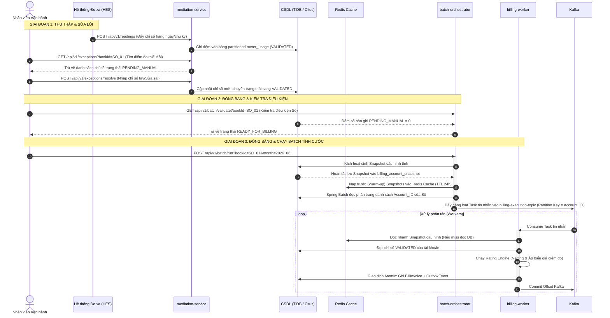
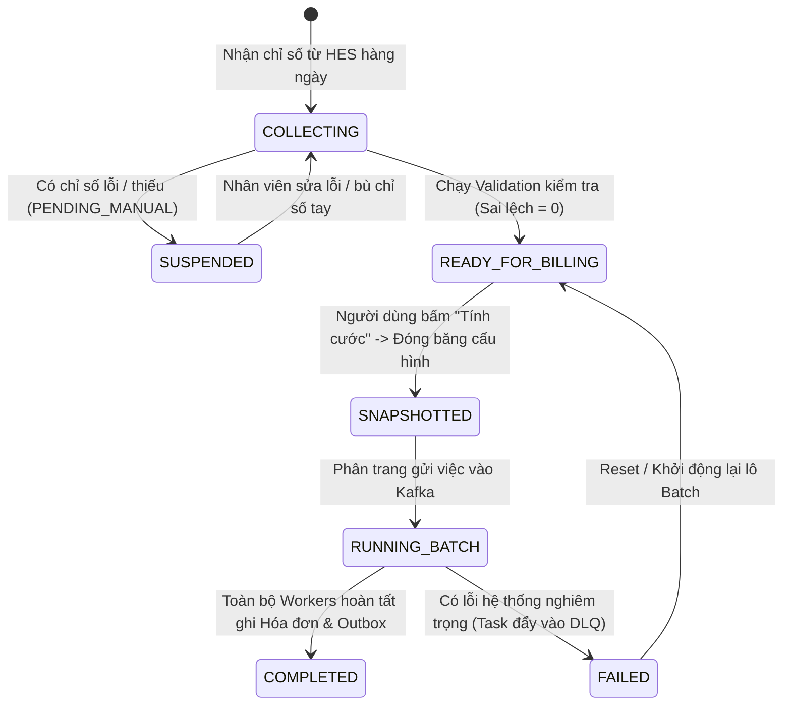

# Đặc tả Luồng Nghiệp vụ: Thu thập, Xác nhận & Tính cước (Business Integration Flow)

Tài liệu này hướng dẫn cách chuyển đổi và ánh xạ luồng nghiệp vụ thủ công từ hệ thống Oracle cũ sang luồng xử lý tự động, hiệu năng cao trên hệ thống Microservices mới.

---

## 1. Bảng đối chiếu Luồng Nghiệp vụ (Legacy vs. New Architecture)

| Bước | Luồng xử lý trên Hệ thống cũ (Oracle) | Luồng xử lý trên Hệ thống mới (Microservices) | Cải tiến & Lợi ích |
| :--- | :--- | :--- | :--- |
| **1. Nhận chỉ số đo xa (HES)** | Người dùng chọn Sổ $\rightarrow$ Kích hoạt quét hàng đợi $\rightarrow$ Kéo dữ liệu chỉ số từ bảng đo xa HES về bảng chỉ số tính cước. | Tự động hóa hoàn toàn: 1. **Push**: Hệ thống đo xa (HES) đẩy trực tiếp qua REST API `/api/v1/readings` ngay khi thu thập. 2. **Pull (Nghiệp vụ)**: Expose API `POST /api/v1/readings/ingest?bookId=...` để người dùng kích hoạt kéo dữ liệu từ CSDL HES về DB Staging qua lô (Batch insert). | Giảm thiểu thao tác thủ công. Tận dụng ghi lô song song (`rewriteBatchedInserts=true`) giúp ghi nhận hàng triệu chỉ số chỉ trong vài phút. |
| **2. Bù chỉ số thiếu / Sửa sai** | Nhân viên rà soát lỗi trên màn hình Oracle, gõ tay chỉ số bù cho các điểm đo bị thiếu hoặc bị lệch lớn. | **Exception Portal (REST APIs)**: - `GET /api/v1/exceptions?bookId=...`: Lọc nhanh các điểm đo bị thiếu chỉ số hoặc trạng thái `PENDING_MANUAL`. - `POST /api/v1/exceptions/resolve`: Cập nhật chỉ số trực tiếp từ UI và đổi trạng thái bản ghi sang `VALIDATED`. | Giao diện hiện đại, tối ưu tìm kiếm lỗi qua indexing phân tán. |
| **3. Kiểm tra điều kiện tính cước** | Chạy tool kiểm tra điều kiện (Check các trạm biến áp, công tơ phụ đã đủ chỉ số chưa) $\rightarrow$ Đổi trạng thái Sổ. | **Readiness Checklist API**: `GET /api/v1/batch/validate?bookId=...&month=...` Kiểm tra số lượng bản ghi `PENDING_MANUAL` của Sổ. Nếu bằng `0`, tự động chuyển trạng thái sổ sang `READY_FOR_BILLING`. | Kiểm tra tự động nhanh chóng qua truy vấn Index của CSDL phân tán. |
| **4. Tính hóa đơn** | Người dùng chọn Sổ đủ điều kiện $\rightarrow$ Chạy lệnh tính hóa đơn. Quá trình tính tuần tự trên Oracle dễ gây nghẽn. | **Asynchronous Batch Execution**: Người dùng click "Tính cước" trên UI $\rightarrow$ API `POST /api/v1/batch/run?bookId=...` kích hoạt Spring Batch phân trang đẩy việc vào Kafka $\rightarrow$ Worker Virtual Threads xử lý song song. | Tính cước phi tuần tự, tự động scale-out, hoàn thành cước cho hàng triệu hộ dân trong vài phút thay vì vài tiếng. |

---

## 2. Mô hình luồng dữ liệu chi tiết (Sequence Workflow)

Dưới đây là sơ đồ phối hợp hoạt động giữa các Module mới để mô phỏng lại luồng nghiệp vụ chốt cước:

---

## 3. Quản lý trạng thái Sổ (Billing Book State Machine)

Hệ thống quản lý tiến trình của một Sổ ghi chỉ số thông qua các trạng thái sau để kiểm soát chất lượng dữ liệu:

### Các quy tắc nghiệp vụ áp dụng:
1. **Chặn tính cước khi chưa sẵn sàng**: Nút "Tính cước" trên giao diện chỉ khả dụng khi Sổ đạt trạng thái `READY_FOR_BILLING`.
2. **Cho phép chạy lại (Re-billing)**: Nếu phát hiện lỗi sau khi đã tính cước, người dùng có thể kích hoạt tính lại. Hệ thống sẽ tăng `calculation_version` lên `2`, xóa cache snapshot cũ trên Redis, sinh snapshot mới và chạy lại tiến trình Batch cho Sổ đó. Hóa đơn mới sẽ ghi đè hóa đơn cũ nhờ cơ chế Idempotency Key (`accountId_month_version`).
