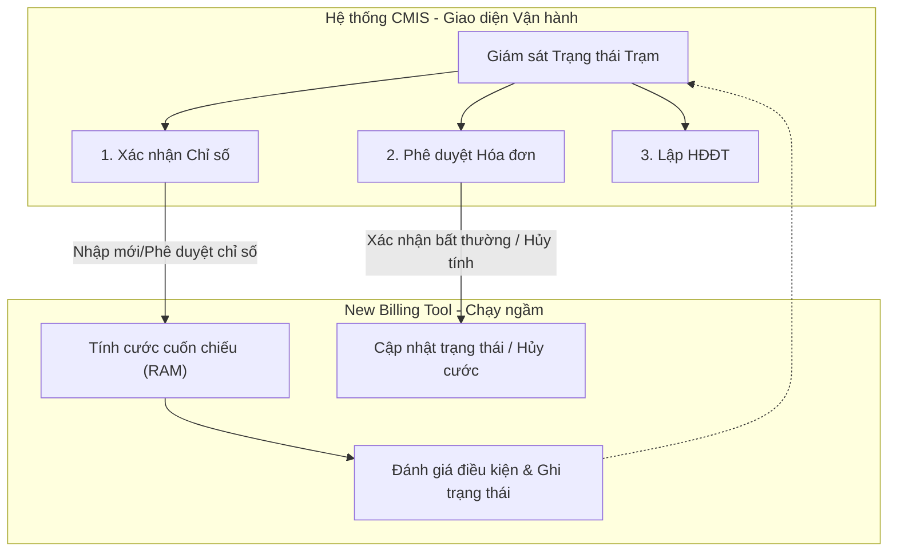
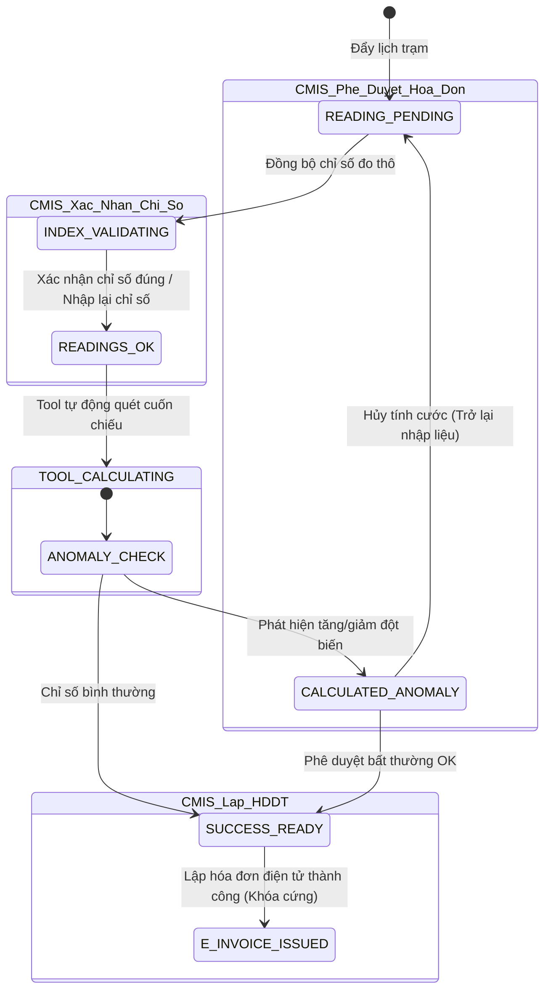

# Quy Trình Nghiệp Vụ Tính Cước & Thao Tác Vận Hành (Business Workflow Specification)

Tài liệu này đặc tả chi tiết sự phân tách trách nhiệm giữa **Công cụ tính toán mới (New Billing Tool - Chạy ngầm)** và **Hệ thống CMIS (Giao diện vận hành của người dùng)**, tối ưu hóa quy trình nghiệp vụ theo mô hình xử lý cuốn chiếu và kiểm soát chất lượng theo trạm biến áp/mã sổ.

---

## 1. Phân Tách Trách Nhiệm Hệ Thống (Separation of Concerns)

### A. Nguyên tắc xử lý của Tool mới (New Billing Tool)
*   **Xử lý cuốn chiếu tự động**: Tool mới chạy ngầm 24/7 (phản ứng theo sự kiện Kafka hoặc Batch kích hoạt), liên tục tính toán hóa đơn cho những khách hàng đã đủ điều kiện (đủ chỉ số đầu vào, không có lỗi sơ đồ topology).
*   **Ghi nhận trạng thái**: Đối với các trường hợp không đủ điều kiện tính toán (thiếu chỉ số) hoặc sau khi tính toán phát hiện hóa đơn bất thường, Tool mới **chỉ ghi nhận trạng thái cảnh báo vào Database/Cache** chứ không tự ý chuyển tiếp sang luồng lập hóa đơn điện tử.

### B. Chức năng giám sát Trạm trên CMIS
CMIS xây dựng màn hình giám sát trực quan theo từng Trạm biến áp / Mã Sổ, thể hiện rõ ràng 3 chỉ số trạng thái nghiệp vụ:
1.  **Số lượng khách hàng chưa sẵn sàng về chỉ số (Readings Pending / Invalidated)**: Các khách hàng đang thiếu chỉ số hoặc chỉ số nghi ngờ cần rà soát.
2.  **Số lượng khách hàng có hóa đơn bất thường (Calculated Anomalies)**: Các hóa đơn có sản lượng đột biến cần kiểm duyệt thủ công.
3.  **Số lượng khách hàng tính hóa đơn thành công (Success / Ready for E-Invoice)**: Các hóa đơn bình thường hoặc bất thường đã phê duyệt, sẵn sàng ký số hóa đơn điện tử.

---

## 2. Chi Tiết 3 Chức Năng Nghiệp Vụ trên CMIS

Người dùng truy cập vào từng chức năng tương ứng với trạng thái của trạm trên màn hình giám sát để xử lý nghiệp vụ:

### Chức năng 1: Xác nhận Chỉ số (Index Confirmation)
*   **Mục đích**: Xử lý các khách hàng chưa đủ điều kiện tính hóa đơn do vấn đề chỉ số.
*   **Kịch bản 1: Xác nhận chỉ số thô là đúng**:
    *   *Thao tác*: Nhân viên xác nhận chỉ số đo thô (AMR) nghi ngờ là chính xác.
    *   *Hành động của Tool*: Kích hoạt Tool mới ngay lập tức chạy áp giá và tính toán hóa đơn cho khách hàng đó.
*   **Kịch bản 2: Nhập lại chỉ số (Bù/Hiệu chỉnh chỉ số)**:
    *   *Thao tác*: Nhân viên nhập chỉ số mới thay thế chỉ số lỗi.
    *   *Hành động của Tool*: Tiếp nhận chỉ số hiệu chỉnh $\rightarrow$ Tự động chạy lại quy trình kiểm tra điều kiện $\rightarrow$ Nếu đủ điều kiện, Tool tự động tiến hành tính toán lại hóa đơn.

### Chức năng 2: Tính hóa đơn & Phê duyệt (Invoice Approval & Anomalies)
*   **Mục đích**: Rà soát, kiểm duyệt hóa đơn sau khi Tool mới đã tính toán.
*   **Kịch bản 1: Phê duyệt hóa đơn bất thường (Xác nhận OK)**:
    *   *Thao tác*: Nhân viên xác nhận hóa đơn bất thường là đúng thực tế tiêu thụ.
    *   *Hành động của Tool*: Ghi nhận phê duyệt, chuyển trạng thái tài khoản thành **Sẵn sàng lập hóa đơn điện tử** (Trạng thái `SUCCESS_CMIS` hoặc `LOCKED`).
*   **Kịch bản 2: Hủy tính (Hóa đơn sai)**:
    *   *Thao tác*: Nhân viên chọn hủy tính toán đối với hóa đơn lỗi chỉ số.
    *   *Hành động của Tool*: Ghi nhận trạng thái hủy tính cước, xóa hóa đơn tạm thời, đưa tài khoản về trạng thái **Chờ đẩy lại chỉ số** để tính toán lại từ đầu.

### Chức năng 3: Lập Hóa đơn Điện tử (E-Invoice Issuance)
*   **Mục đích**: Phát hành hóa đơn tài chính chính thức.
*   **Thao tác**: Cho phép nhân viên chọn phát hành hóa đơn điện tử hàng loạt hoặc riêng lẻ cho các khách hàng đã ở trạng thái **Sẵn sàng** (không có lỗi chỉ số, hóa đơn bình thường hoặc bất thường đã được phê duyệt).
*   **Hành động của Tool**: Ký số hóa đơn, gửi dữ liệu sang tổng cục thuế và khóa trạng thái chốt cước (`LOCKED`/`E_INVOICE_ISSUED`) của khách hàng để bảo toàn dữ liệu kế toán.

---

## 3. Bản Đồ Trạng Thái Khách Hàng (State Machine)

Dưới đây là sơ đồ chuyển trạng thái của khách hàng trong hệ thống qua các cổng kiểm soát CMIS:

