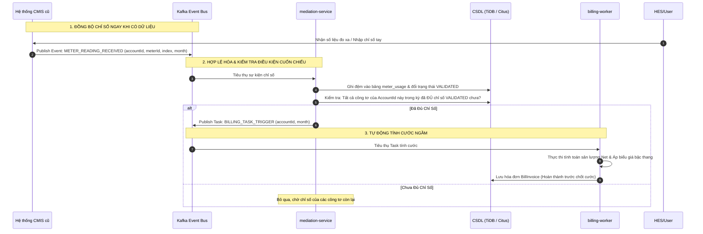
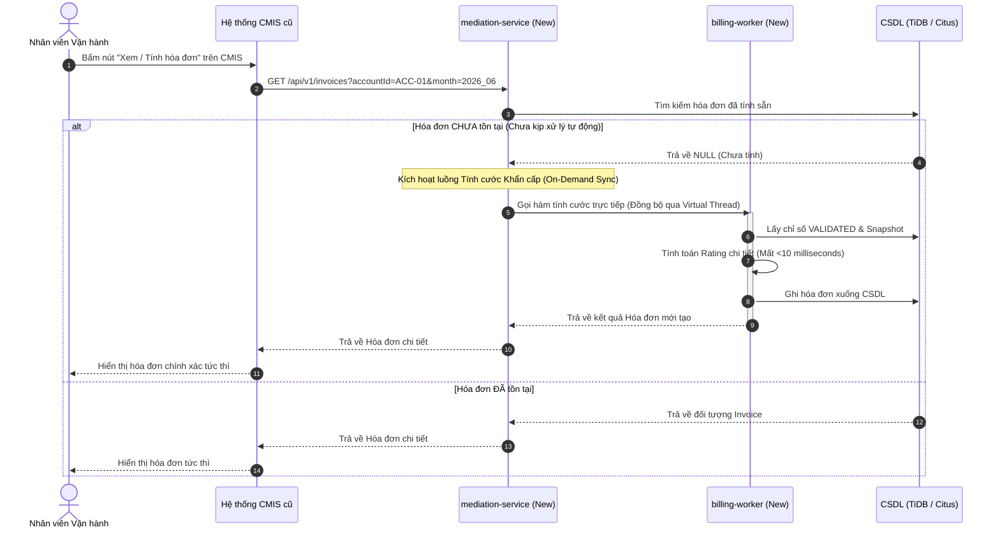

# Kiến trúc Tích hợp Hệ thống CMIS cũ & Hệ thống Tính cước mới (CMIS Co-existence & Reactive Billing Architecture)

Tài liệu này đặc tả phương án tích hợp và đồng bộ dữ liệu giữa hệ thống lõi CMIS cũ và hệ thống tính cước Microservices mới theo mô hình **Tích hợp Bất đồng bộ dựa trên Sự kiện (Event-Driven)** kết hợp **Tính cước Thời gian thực (Real-time Reactive Billing)** và **Fallback Đồng bộ (On-Demand Synchronous Fallback)**.

---

## 1. Nguyên tắc Thiết kế Tích hợp

1. **CMIS giữ vai trò UI & Control Plane**: Nhân viên vận hành vẫn thao tác xác nhận chỉ số, sửa tay và bấm nút chạy tính toán hóa đơn trên giao diện CMIS như bình thường.
2. **Hệ thống mới đóng vai trò High-Performance Calculation Engine**: Toàn bộ luồng nhận chỉ số, kiểm tra điều kiện, và tính toán được thực hiện ngầm (background) một cách tự động thông qua các sự kiện Kafka ngay khi có dữ liệu.
3. **Mô hình Trạng thái Song song (Dual-state)**: Chỉ số thu được từ HES hoặc sửa tay trên CMIS sẽ được đồng bộ ngay lập tức sang hệ thống mới qua Kafka để tính toán trước.

---

## 2. Kiến trúc Luồng xử lý Bất đồng bộ & Phản ứng (Reactive Billing)

Thay vì chờ đến cuối chu kỳ chạy Batch lớn, hệ thống mới sẽ **tự động tính cước cuốn chiếu cho từng khách hàng** ngay khi họ có đầy đủ chỉ số hợp lệ.

---

## 3. Luồng Fallback Đồng bộ khi Người dùng truy vấn trên CMIS (On-Demand Sync)

Khi người dùng thao tác xem chi tiết hóa đơn hoặc kích hoạt chốt cước trên giao diện CMIS:

### Kịch bản A: Hệ thống mới ĐÃ tính toán tự động thành công (99% các trường hợp)
1. User click "Xem hóa đơn" của khách hàng `ACC-01` trên CMIS.
2. CMIS gọi API sang hệ thống mới: `GET /api/v1/invoices?accountId=ACC-01&month=2026_06`.
3. Hệ thống mới trả về ngay lập tức dữ liệu hóa đơn đã được tính trước đó từ CSDL phân tán. CMIS hiển thị tức thời cho người dùng.

### Kịch bản B: Chỉ số vừa sửa/nhập tay chưa kịp tính toán tự động
Nếu dữ liệu chỉ số vừa được nhập tay và người dùng bấm nút xem ngay lập tức khiến hệ thống mới chưa kịp tính toán bất đồng bộ xong:

---

## 4. Các giải pháp kỹ thuật đảm bảo tính nhất quán (Consistency & Idempotency)

1. **Khóa chống tính trùng (Idempotency Key)**:
   * Mã định danh hóa đơn được chuẩn hóa: `INV-{accountId}-{month}-v{version}`.
   * Khóa Idempotency Key duy nhất trên cơ sở dữ liệu: `accountId_month_version`.
   * Nếu CMIS kích hoạt lệnh tính toán trùng lặp hoặc gửi trùng sự kiện chỉ số, hệ thống mới sẽ từ chối xử lý trùng lặp nhờ ràng buộc `UNIQUE` trên DB phân tán.
2. **Cơ chế Hủy Cache tức thời (Instant Invalidation)**:
   * Khi CMIS gửi sự kiện sửa chỉ số mới, hệ thống mới sẽ ngay lập tức xóa cache Redis của hóa đơn cũ (nếu có) trước khi chạy tính toán lại, tránh trường hợp CMIS đọc phải dữ liệu hóa đơn cũ chưa cập nhật.
3. **Mô hình CQRS (Command Query Responsibility Segregation)**:
   * Hệ thống mới đóng vai trò lưu trữ toàn bộ lịch sử hóa đơn chốt cước chi tiết kèm `billing_manifest`.
   * CMIS chỉ cần đọc (Read-only query) dữ liệu này về để hiển thị hoặc in ấn hóa đơn, giảm tải tối đa các tác vụ tính cước nặng nề cho CMIS.
