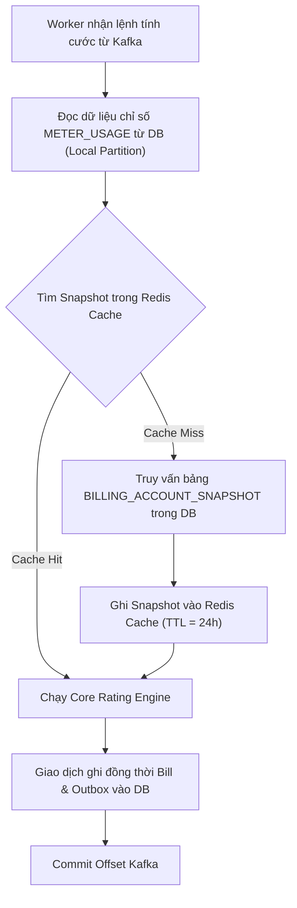

# Luồng Giao tiếp & Định dạng Thông điệp (Communication & Integration Flows)

Tài liệu này định nghĩa chi tiết các API Gateway, cấu trúc thông điệp (Payload) truyền tải qua hàng đợi Apache Kafka và luồng hoạt động chi tiết của cơ chế bộ nhớ đệm Cache-aside.

---

## 1. REST APIs (Tầng Thu Thập & Xử Lý Thủ Công)

### A. API Tiếp nhận chỉ số đo đếm thô (Mediation Service API)
Được gọi bởi hệ thống AMR/AMI tự động (đẩy theo ngày) hoặc các Handheld Tool.
- **Endpoint**: `POST /api/v1/readings`
- **Content-Type**: `application/json`
- **Request Payload**:
```json
{
  "readings": [
    {
      "accountId": "ACC-EVN-123456",
      "meterPointId": "METER-TONG-01",
      "billingCycleMonth": "2026_06",
      "fromDate": "2026-06-01T00:00:00",
      "toDate": "2026-06-30T23:59:59",
      "startIndex": 5200.50,
      "endIndex": 5620.50
    }
  ]
}
```
- **Phản hồi**: `202 status (Accepted)` - Hệ thống ghi nhận vào DB và đưa vào hàng đợi kiểm tra bất đồng bộ.

---

### B. API Xử lý ngoại lệ chỉ số (Exception Portal API)
Dành cho nhân viên vận hành bổ sung chỉ số bằng tay hoặc sửa đổi chỉ số bị lỗi logic.
- **Lấy danh sách lỗi**: `GET /api/v1/exceptions?bookId=SO_01&month=2026_06`
- **Cập nhật chỉ số sửa đổi**: `POST /api/v1/exceptions/resolve`
- **Request Payload**:
```json
{
  "usageId": 98877665,
  "billingCycleMonth": "2026_06",
  "correctedEndIndex": 5630.00,
  "operatorNote": "Nhập lại chỉ số do công tơ quay vòng thay thế ngày 15/06"
}
```
- **Phản hồi**: `200 OK` - Cập nhật trạng thái bản ghi trong bảng `METER_USAGE` từ `PENDING_MANUAL` sang `VALIDATED`.

---

## 2. Kafka Messages Specification (Thông điệp Phân tán)

### A. Topic Điều phối tính cước: `billing-execution-topic`
- **Partition Key**: `accountId` (Chuỗi - Ví dụ: `"ACC-EVN-123456"`)
- **Mục đích**: Batch Master phát tín hiệu cho các Worker tiêu thụ song song tính cước.
- **Payload JSON**:
```json
{
  "accountId": "ACC-EVN-123456",
  "bookId": "SO_01",
  "billingCycleMonth": "2026_06",
  "calculationVersion": 1,
  "traceId": "0af7651916cd43dd8448eb211c80319c"
}
```

---

### B. Topic Sự kiện Hóa đơn đầu ra (Outbox): `invoice-events`
- **Mục đích**: Debezium CDC phát hiện bản ghi mới trong bảng `outbox_event` và đẩy lên Kafka để tích hợp với SMS, E-Invoice, Ledger...
- **Payload JSON (đã trích xuất từ payload của CDC)**:
```json
{
  "eventId": "b2f676d1-12c8-47ad-9a10-e7fa694c929a",
  "eventType": "INVOICE_CREATED",
  "invoiceId": "INV-EVN-202606-88899",
  "accountId": "ACC-EVN-123456",
  "billingCycleMonth": "2026_06",
  "amountBeforeTax": 767500.00,
  "taxAmount": 76750.00,
  "amountAfterTax": 844250.00,
  "customerEmail": "khachhang123@gmail.com",
  "customerPhone": "0901234567"
}
```

---

## 3. Vòng đời Bộ nhớ đệm (Redis Cache-aside Lifecycle)

Cơ chế Cache-aside được cài đặt tại Worker để bảo vệ Database khỏi tải đọc đột biến.



### A. Chiến lược ghi đệm & Hết hạn (Eviction / Expiration)
- **Khi tạo Snapshot**: Batch Master hoặc Snapshot Generator sau khi tạo Snapshots trong Database sẽ chủ động ghi một bản sao lên Redis Cluster bằng lệnh `SETEX` với TTL = 24 giờ.
- **Tại Worker**: Đọc bằng lệnh `GET`. Nếu Cache Miss, tự động đọc DB và gọi `SETEX` để điền ngược lại cache.

### B. Cơ chế Hủy Cache (Cache Invalidation)
- Khi có nghiệp vụ tính lại cước (Re-billing): Vận hành viên phê duyệt tính toán lại $\rightarrow$ Phiên bản tính cước tăng lên `calculation_version = 2`.
- Hệ thống thực thi:
  1. Xóa Key cũ trên Redis: `DEL snapshot:ACC-EVN-123456:2026_06`.
  2. Tạo bản ghi Snapshot mới trong DB (với `calculation_version = 2`).
  3. Gửi lệnh tính cước mới vào Kafka.

### C. Khả năng chịu lỗi (Graceful Degradation - Fallback)
Nếu cụm Redis Cluster gặp sự cố gián đoạn kết nối vật lý, Worker không được phép dừng chạy Batch:
- Toàn bộ lệnh gọi Redis được bọc trong khối `try-catch`.
- Khi xảy ra exception kết nối Redis, hệ thống ghi nhận cảnh báo `WARN` hệ thống giám sát và tự động kích hoạt **Fallback chế độ Bypass** (truy vấn trực tiếp Database để lấy Snapshot).
- Cài đặt Circuit Breaker (sử dụng Resilience4j) để tạm ngưng gọi Redis trong vòng 5 phút nếu tỷ lệ lỗi kết nối vượt quá 50%, bảo vệ hệ thống tránh bị nghẽn thread do chờ kết nối Redis timeout.
