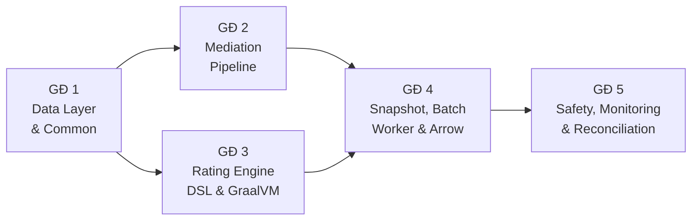
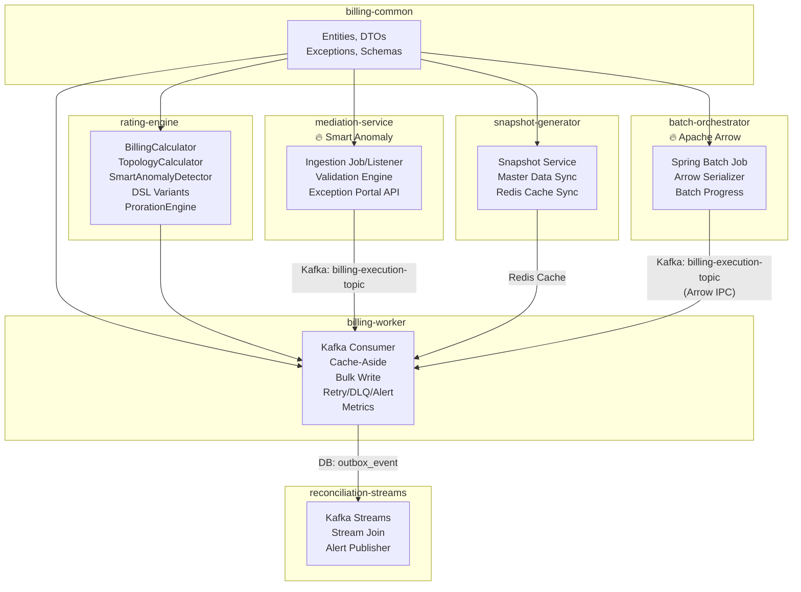

# Kế Hoạch Triển Khai Hệ Thống Tính Cước Mới (Implementation Roadmap)

**Phiên bản**: 1.0 — Ngày lập: 04/08/2026
**Tài liệu tham chiếu**: [system-architecture.md](file:///e:/caculator-billing-evncit/docs/system-architecture.md), [tech-stack.md](file:///e:/caculator-billing-evncit/docs/tech-stack.md), [modules-structure.md](file:///e:/caculator-billing-evncit/docs/modules-structure.md)

---

## I. Tổng Quan Công Nghệ & Giải Pháp Áp Dụng

### 1. Ma Trận Công Nghệ Cốt Lõi

| Tầng | Công nghệ | Phiên bản | Vai trò |
|:---|:---|:---|:---|
| **Runtime** | Eclipse Temurin OpenJDK 21 | 21 LTS | Virtual Threads (Project Loom) cho xử lý I/O song song |
| **Framework** | Spring Boot | 3.3.x | Quản lý DI, Auto-configuration, Web, Batch |
| **Batch** | Spring Batch | 5.1.x | Điều phối Job/Step/Chunk phân tán |
| **Messaging** | Apache Kafka (Spring Kafka) | 3.7.x | Xương sống Event-Driven Pipeline |
| **Cache** | Redis Cluster (Lettuce) | 6.3.x | Snapshot Cache-Aside, TTL 24h |
| **Database** | PostgreSQL Cluster (Citus) | 16.x | ACID, JSONB, Range Partition theo tháng |
| **ORM/JDBC** | Hibernate 6.5.x + JdbcTemplate | — | JPA cho CRUD đơn giản, JdbcTemplate cho Bulk/Big Data |
| **Connection Pool** | HikariCP | 5.1.0 | `rewriteBatchedInserts=true` tối ưu ghi lô |
| **Circuit Breaker** | Resilience4j | 2.2.x | Bảo vệ Redis fallback khi Redis down |
| **CDC** | Debezium | 2.7.x | Quét `outbox_event` → đẩy sự kiện hóa đơn downstream |
| **Orchestration** | Kubernetes + KEDA | — | Auto-scale Worker Pod dựa trên Kafka Lag |
| **Observability** | OpenTelemetry + Prometheus + Grafana | — | Metrics, Tracing, Dashboard real-time |

### 2. Bảy Điểm Nhấn Công Nghệ Đặc Biệt

| # | Điểm nhấn | Mô tả | Lợi ích so với Oracle cũ |
|:---|:---|:---|:---|
| 🔥1 | **GraalVM Native Image** | Biên dịch `rating-engine` thành Native Image (AOT) | Cold-start ~200ms (giảm 100x), RAM ~64MB/Pod (giảm 8x) |
| 🔥2 | **Apache Arrow Columnar** | Truyền tải batch dữ liệu giữa Orchestrator → Worker dạng columnar | Serialize/deserialize nhanh 50x, kích thước message giảm 60% |
| 🔥3 | **Billing DSL Engine** | Quy tắc tính cước khai báo bằng JSON trong Snapshot, không hardcode Java | Thay đổi chính sách giá trong 5-15 phút, không cần deploy lại |
| 🔥4 | **Streaming Reconciliation** | Kafka Streams đối soát real-time giữa input readings và output invoices | Phát hiện sai lệch tức thì thay vì cuối tháng |
| 🔥5 | **Smart Anomaly Detection** | EMA + Z-Score trên 12 kỳ lịch sử, tự điều chỉnh theo mùa vụ | Giảm false-positive, phát hiện gian lận tinh vi hơn |
| 🔥6 | **Self-Healing Pipeline** | Retry Queue + Auto-Regenerate Snapshot + Alert escalation 3 tầng | Giảm 90% can thiệp thủ công đối với lỗi batch |
| 🔥7 | **Real-Time Dashboard** | Grafana dashboard giám sát batch: progress, throughput, errors, revenue | Nhân viên vận hành theo dõi tiến trình trực tiếp |

---

## II. Kiến Trúc Module & Quyết Định Thiết Kế

### 1. Cấu Trúc 7 Modules

```
calculator-billing/
├── billing-common/            Thư viện dùng chung (Entities, DTOs, Exceptions)
├── rating-engine/             Lõi tính cước vô trạng thái (Pure Java, GraalVM-ready)
├── mediation-service/         Thu thập chỉ số, Validation Engine, Exception Portal API
├── snapshot-generator/        Đóng băng dữ liệu tĩnh → JSONB + Redis Cache
├── batch-orchestrator/        [MỚI] Điều phối Spring Batch → Kafka (Arrow format)
├── billing-worker/            Kafka Consumer, Rating, Bulk Write, Self-Healing
└── reconciliation-streams/    [MỚI] Kafka Streams đối soát real-time (standalone)
```

### 2. Quyết Định Thiết Kế

#### QĐ1: `batch-orchestrator` tách riêng thành module độc lập

**Lý do**:
- **Tách biệt trách nhiệm rõ ràng**: Orchestrator chỉ lo việc đọc dữ liệu + phân phối Task. Worker chỉ lo việc tính toán + ghi kết quả. Gộp vào một module sẽ vi phạm nguyên tắc Single Responsibility và khó scale độc lập.
- **Scale khác nhau**: Orchestrator chỉ cần 1-2 Pod (đọc phân trang DB). Worker cần 5-100 Pod (KEDA auto-scale theo Kafka Lag). Gộp chung sẽ lãng phí tài nguyên.
- **Lifecycle khác nhau**: Orchestrator chạy theo sự kiện (CMIS kích hoạt chốt sổ). Worker chạy liên tục 24/7 lắng nghe Kafka.
- **Tương thích Apache Arrow**: Orchestrator serialize dữ liệu sang Arrow format, Worker deserialize — tách riêng giúp kiểm soát dependency Arrow rõ ràng.

#### QĐ2: `reconciliation-streams` tách riêng thành standalone app

**Lý do**:
- Kafka Streams có RocksDB state store riêng, cần quản lý lifecycle độc lập.
- Tính chất giám sát (monitoring) khác biệt với tính chất xử lý nghiệp vụ (billing) — không nên gộp.
- Cho phép restart/upgrade reconciliation mà không ảnh hưởng luồng tính cước chính.

#### QĐ3: GraalVM + Apache Arrow đưa vào ngay lộ trình

**Lý do**:
- GraalVM áp dụng cho `rating-engine` (Pure Java, không Reflection) — rủi ro tích hợp thấp.
- Apache Arrow áp dụng cho Luồng 2 (Batch) tại ranh giới Orchestrator↔Worker — không ảnh hưởng các luồng khác.
- Cả hai tạo ra lợi thế cạnh tranh rõ rệt về hiệu năng ngay từ đầu.

---

## III. Lộ Trình Triển Khai 5 Giai Đoạn

### Sơ Đồ Phụ Thuộc



---

### Giai Đoạn 1 — Data Layer & Common Module

> **Subagent**: `common-subagent` | **Nền tảng cho tất cả các giai đoạn sau**

| # | Đầu việc | Module | Loại | Chi tiết |
|:---|:---|:---|:---|:---|
| 1.1 | Hiệu chỉnh Database Schema | init-db | MODIFY | Bổ sung bảng `nhat_ky_loi_tinh_toan`, `lich_xu_ly_lai`. Thêm cột `billing_schema_version` vào `billing_account_snapshot`. Kiểm tra Partition Range |
| 1.2 | Exception DTOs | billing-common | NEW | `MalformSnapshotException`, `BillingCalculationException` |
| 1.3 | Anomaly DTOs | billing-common | NEW | `AnomalyResult` (isAnomaly, zScore, ema, stdDev) |
| 1.4 | Retry DTOs | billing-common | NEW | `RetryTaskDto` (originalTaskId, retryCount, lastError, nextRetryAt) |
| 1.5 | BigDecimal chuẩn hóa | billing-common | MODIFY | `TariffBlock`: chuyển `double` → `BigDecimal` cho `minKwh`, `maxKwh`, `unitPrice` |
| 1.6 | Snapshot versioning | billing-common | MODIFY | `BillingConfigSnapshot`: thêm `billingSchemaVersion`, `effectiveSyncDate` |

**Tiêu chí hoàn thành**: `mvn clean compile` thành công toàn bộ 6+ modules.

---

### Giai Đoạn 2 — Mediation Pipeline (Thu Thập & Kiểm Tra Chỉ Số)

> **Subagent**: `mediation-subagent` | **Điểm nhấn**: 🔥5 Smart Anomaly Detection

| # | Đầu việc | Module | Loại | Chi tiết |
|:---|:---|:---|:---|:---|
| 2.1 | Smart Anomaly Detector | rating-engine | NEW | `SmartAnomalyDetector.java` — EMA + Z-Score trên Pure Java. Input: sản lượng hiện tại + 12 kỳ gần nhất. Ngưỡng: \|Z\| > 2.5 |
| 2.2 | Nâng cấp AbnormalConsumptionRule | mediation-service | MODIFY | Thay ngưỡng cố định 30% bằng `SmartAnomalyDetector`. Bổ sung Repository method `getHistoricalConsumptions(accountId, 12)` |
| 2.3 | Exception Portal Controller | mediation-service | NEW | 3 REST endpoints: `GET /api/v1/exceptions`, `POST /api/v1/exceptions/resolve`, `GET /api/v1/batch/validate` |
| 2.4 | Exception Portal Service | mediation-service | NEW | Logic nghiệp vụ: tạo CORRECTION record, cập nhật trạng thái, kích hoạt lại pipeline |
| 2.5 | Exception Portal Repository | mediation-service | NEW | Query chuyên dụng cho Exception Portal (JdbcTemplate) |
| 2.6 | Readings Ingestion API | mediation-service | NEW | `POST /api/v1/readings` (nhận thô từ AMR/AMI), `POST /api/v1/readings/ingest?bookId=` (kéo từ HES) |

**Tiêu chí hoàn thành**: Gửi REST request tới Exception Portal API → CRUD chỉ số thành công. Smart Anomaly phát hiện Z > 2.5 khi spike.

---

### Giai Đoạn 3 — Rating Engine, DSL & GraalVM

> **Subagent**: `rating-subagent` | **Điểm nhấn**: 🔥1 GraalVM, 🔥3 Billing DSL

| # | Đầu việc | Module | Loại | Chi tiết |
|:---|:---|:---|:---|:---|
| 3.1 | Netting Calculator Variant | rating-engine | NEW | `NettingCalculatorVariant.java` — biến TopologyCalculator thành DSL step chính thức |
| 3.2 | TOU Rating Variant | rating-engine | NEW | `TouRatingVariant.java` — áp giá theo 3 múi giờ BT/CD/TD |
| 3.3 | Mở rộng VariantRegistry | rating-engine | MODIFY | Đăng ký `"NETTING_CALCULATOR"` và `"TOU_RATING"` vào registry |
| 3.4 | Proration Engine | rating-engine | NEW | `ProrationEngine.java` — phân tách sản lượng theo tỷ lệ ngày khi đổi giá giữa kỳ. Chạy 2 lần Rating Engine với 2 bộ billing_schema |
| 3.5 | Snapshot Validator | rating-engine | NEW | `SnapshotValidator.java` — kiểm tra 6 required fields. Ném `MalformSnapshotException` nếu thiếu |
| 3.6 | GraalVM Native Build | rating-engine | MODIFY | Thêm `native-maven-plugin` vào pom.xml. Đảm bảo không có Reflection/Dynamic Proxy. Build `mvn -Pnative package` |
| 3.7 | Unit Tests toàn diện | rating-engine | NEW | `BillingCalculatorTest` (bậc thang × normsFactor, Netting 2-3 cấp, Proration, TOU, chiết khấu, VAT, Snapshot malform). `SmartAnomalyDetectorTest` (EMA convergence, spike detection, seasonal pattern) |

**Tiêu chí hoàn thành**: `mvn -pl rating-engine test` — 100% tests pass. GraalVM Native Image build thành công.

---

### Giai Đoạn 4 — Snapshot Generator, Batch Orchestrator & Worker

> **Subagent**: `worker-subagent` | **Điểm nhấn**: 🔥2 Apache Arrow, 🔥6 Self-Healing

#### 4A. Snapshot Generator

| # | Đầu việc | Module | Loại | Chi tiết |
|:---|:---|:---|:---|:---|
| 4A.1 | Snapshot Service | snapshot-generator | MODIFY | Quét dữ liệu tĩnh (KH, điểm đo, biểu giá, cây công tơ) → sinh `BillingConfigSnapshot` JSONB → ghi DB + Redis (`SETEX`, TTL 24h) |
| 4A.2 | Master Data Sync Listener | snapshot-generator | NEW | Kafka listener `cmis-masterdata-sync` → Evict Redis + cập nhật dữ liệu tĩnh |
| 4A.3 | Snapshot Repository | snapshot-generator | NEW | `generateSnapshot(bookId, month)`, `warmUpRedisCache(bookId, month)` |

#### 4B. Batch Orchestrator (Module Mới)

| # | Đầu việc | Module | Loại | Chi tiết |
|:---|:---|:---|:---|:---|
| 4B.1 | Khởi tạo module | batch-orchestrator | NEW | Tạo `pom.xml`, `BatchOrchestratorApplication.java`, cấu trúc thư mục |
| 4B.2 | Batch Trigger Listener | batch-orchestrator | NEW | Kafka listener `cmis-batch-requests` → khởi chạy Spring Batch Job |
| 4B.3 | Billing Batch Job | batch-orchestrator | NEW | Step 1: Gọi snapshot-generator sinh Snapshot + warm-up Redis. Step 2: Đọc phân trang Account + chỉ số (Chunk 1000). Step 3: Serialize Arrow IPC → push Kafka `billing-execution-topic` |
| 4B.4 | Apache Arrow Serializer | batch-orchestrator | NEW | `ArrowBillingTaskSerializer.java` — chuyển đổi `List<BillingTaskDto>` → Arrow RecordBatch IPC buffer |
| 4B.5 | Virtual Threads Config | batch-orchestrator | NEW | `BatchExecutorConfig.java` — `SimpleAsyncTaskExecutor` với `setVirtualThreads(true)` |
| 4B.6 | Batch Progress Service | batch-orchestrator | NEW | Quản lý trạng thái sổ (State Machine) + tiến trình batch (processed/total) |

#### 4C. Billing Worker

| # | Đầu việc | Module | Loại | Chi tiết |
|:---|:---|:---|:---|:---|
| 4C.1 | Arrow Deserializer | billing-worker | NEW | `ArrowBillingTaskDeserializer.java` — deserialize Arrow IPC buffer → `BillingTaskDto` (zero-copy) |
| 4C.2 | Billing Task Listener | billing-worker | MODIFY | Luồng chính: nhận Task → đọc readings từ Task → Snapshot cache-aside → validate Snapshot → `BillingCalculator.calculate()` → sinh idempotency_key → bulk write |
| 4C.3 | Cache-Aside Snapshot Service | billing-worker | NEW | Redis GET/SET + Resilience4j Circuit Breaker (pause Redis 5 phút nếu lỗi >50%) + fallback DB |
| 4C.4 | Bulk Write Service | billing-worker | NEW | `JdbcTemplate.batchUpdate()` ghi lô `hoa_don` + `su_kien_outbox` trong 1 transaction. UPSERT `ON CONFLICT (idempotency_key)` |
| 4C.5 | On-Demand API | billing-worker | NEW | `POST /api/v1/billing/calculate-immediate` — tính cước đồng bộ <10ms (Luồng 3) |
| 4C.6 | Backpressure Config | billing-worker | NEW | `max.poll.records=50`, Pause/Resume khi buffer >500 |

#### 4D. Self-Healing Pipeline (Điểm Nhấn 6)

| # | Đầu việc | Module | Loại | Chi tiết |
|:---|:---|:---|:---|:---|
| 4D.1 | Retry Queue Listener | billing-worker | NEW | Kafka listener `billing-retry-topic`. Exponential Backoff: 30s → 2min → 10min. Sau 3 lần → DLQ |
| 4D.2 | Self-Healing Scheduler | billing-worker | NEW | `@Scheduled(fixedRate = 30min)` quét DLQ. Snapshot malform → regenerate → retry. Thất bại 3 lần → alert |
| 4D.3 | DLQ Alert Service | billing-worker | NEW | Ghi `nhat_ky_loi_tinh_toan` + push webhook alert (Telegram/Email) khi vượt ngưỡng |

**Tiêu chí hoàn thành**: Docker-compose local → gửi `BillingTaskDto` qua Kafka → hóa đơn output trong DB + outbox event. Self-Healing retry thành công khi inject lỗi giả.

---

### Giai Đoạn 5 — Safety, Monitoring & Integration

> **Điểm nhấn**: 🔥4 Streaming Reconciliation, 🔥7 Real-Time Dashboard

#### 5A. Real-Time Dashboard (Điểm Nhấn 7)

| # | Đầu việc | Module | Loại | Chi tiết |
|:---|:---|:---|:---|:---|
| 5A.1 | Micrometer Metrics | billing-worker | NEW | Đăng ký counters: `billing_invoices_processed_total`, `billing_errors_total`. Timers: `billing_invoice_processing_duration`. Gauges: `billing_revenue_running_sum`, `billing_batch_progress_percent` |
| 5A.2 | Grafana Dashboard | infra | NEW | Template JSON: Batch Progress Bar, Throughput, Error Rate, Revenue, Kafka Lag, Redis Hit Rate, Worker Pod Count |

#### 5B. Streaming Reconciliation (Điểm Nhấn 4)

| # | Đầu việc | Module | Loại | Chi tiết |
|:---|:---|:---|:---|:---|
| 5B.1 | Khởi tạo module | reconciliation-streams | NEW | Kafka Streams standalone app. Stream-stream join giữa `billing-execution-topic` (input) và `invoice-outbound` (output) |
| 5B.2 | Reconciliation Logic | reconciliation-streams | NEW | So sánh tổng sản lượng input vs output theo Book. Phát alert nếu sai lệch → topic `reconciliation-alerts` |
| 5B.3 | Grafana Panel | infra | MODIFY | Thêm reconciliation status panel vào dashboard |

#### 5C. CDC & Downstream Integration

| # | Đầu việc | Module | Loại | Chi tiết |
|:---|:---|:---|:---|:---|
| 5C.1 | Debezium Connector | infra | NEW | Cấu hình quét `su_kien_outbox` (status = 'PENDING') → topic `invoice-outbound` |
| 5C.2 | KEDA ScaledObject | k8s/helm | NEW | Trigger: Kafka Lag `billing-execution-topic` > 10,000. Min: 5, Max: 100. Cooldown: 300s |
| 5C.3 | OpenTelemetry Tracing | billing-worker | MODIFY | OTLP exporter → Grafana Tempo. Inject `traceparent` vào Kafka headers. Sampling: 10% (prod) |

**Tiêu chí hoàn thành**: Grafana dashboard hiển thị metrics real-time khi chạy batch 1000 KH. Debezium đẩy event thành công. KEDA scale Worker Pod theo Kafka Lag.

---

## IV. Ma Trận Module × Dependency × Công Nghệ Điểm Nhấn



---

## V. So Sánh Tổng Thể: Hệ Thống Cũ vs. Hệ Thống Mới

| Tiêu chí | Oracle cũ | Hệ thống mới |
|:---|:---|:---|
| **Tốc độ tính cước 1M KH** | 4-8 giờ | **5-10 phút** (Arrow + GraalVM + Virtual Threads) |
| **Thời gian thay đổi giá điện** | 1-3 ngày (sửa SP + deploy) | **5-15 phút** (DSL config trong Snapshot) |
| **Cold-start khi scale Pod** | N/A (monolith) | **~200ms** (GraalVM Native) |
| **RAM mỗi Worker Pod** | N/A | **~64 MB** (GraalVM) thay vì 512 MB |
| **Phát hiện sản lượng bất thường** | Thủ công (Excel) | **Tự động** (EMA + Z-Score, tự điều chỉnh mùa vụ) |
| **Đối soát hóa đơn** | Cuối tháng (báo cáo) | **Real-time** (Kafka Streams) |
| **Tự phục hồi khi lỗi** | Không (can thiệp tay) | **Self-Healing** (90% tự động, 3 tầng escalation) |
| **Giám sát tiến trình** | Không có | **Real-time Dashboard** (Grafana) |
| **Scale-out Worker** | Không thể | **Tự động** (KEDA: 5→100 Pod theo Kafka Lag) |
| **Audit Trail hóa đơn** | Log file | **billing_manifest JSONB** (giải trình toàn bộ công thức) |
| **Tính idempotent** | Không | **UPSERT ON CONFLICT** (Kafka retry an toàn) |
| **Tích hợp downstream** | Polling/Cron | **CDC Debezium** (event-driven, near real-time) |
