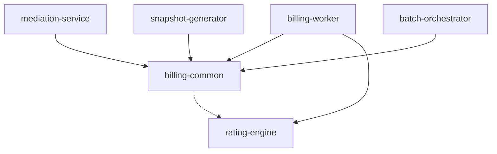

# Đặc tả Cấu trúc Phân rã Modules Dự án (Multi-Module Project Architecture)

Tài liệu này hướng dẫn cách tổ chức mã nguồn theo mô hình Multi-Module Maven trong Java, phân định rõ ràng vai trò của từng cấu phần và các dependencies đi kèm.

---

## 1. Sơ đồ Cấu trúc thư mục (Directory Hierarchy)

Dự án được đặt tên gốc là `calculator-billing` và được phân chia thành các sub-modules sau:

```text
calculator-billing/  (Root Directory)
 ├── pom.xml         (Parent POM - Quản lý Dependencies & Versions)
 │
 ├── billing-common/  (Thư viện dùng chung)
 │    ├── src/main/java/com/evn/billing/common/
 │    │    ├── domain/     (JPA Entities: Account, MeterUsage, etc.)
 │    │    ├── dto/        (DTOs: BillingConfigSnapshot, Jackson schema)
 │    │    └── exception/  (Lớp ngoại lệ định nghĩa dùng chung)
 │    └── pom.xml
 │
 ├── rating-engine/   (Lõi định giá vô trạng thái - Pure Java)
 │    ├── src/main/java/com/evn/billing/engine/
 │    │    ├── NettingCalculator.java  (Tính toán sản lượng công tơ)
 │    │    └── SteppingRatingEngine.java (Tính toán giá bậc thang & định mức)
 │    └── pom.xml
 │
 ├── mediation-service/ (Module thu thập chỉ số & Portal Exception API)
 │    ├── src/main/java/com/evn/billing/mediation/
 │    │    ├── controller/ (REST Controllers tiếp nhận chỉ số & Duyệt sửa tay)
 │    │    ├── service/    (Lọc trùng, tính toán thô)
 │    │    └── repository/ (Giao tiếp bảng account, meter_usage)
 │    ├── src/main/resources/application.yml
 │    └── pom.xml
 │
 ├── snapshot-generator/ (Module quét đóng băng dữ liệu tĩnh)
 │    ├── src/main/java/com/evn/billing/snapshot/
 │    │    ├── service/    (Tạo snapshot JSONB, đồng bộ cache Redis)
 │    │    └── scheduler/  (Quét tự động trước giờ chốt sổ)
 │    ├── src/main/resources/application.yml
 │    └── pom.xml
 │
 ├── batch-orchestrator/ (Module Spring Batch Master - Điều phối)
 │    ├── src/main/java/com/evn/billing/batch/
 │    │    ├── job/        (Spring Batch Job: Chunk reader, Kafka producer)
 │    │    └── controller/ (API kích hoạt Job theo Sổ / Book_ID)
 │    ├── src/main/resources/application.yml
 │    └── pom.xml
 │
 └── billing-worker/   (Module Worker xử lý phân tán - Spring Kafka Consumer)
      ├── src/main/java/com/evn/billing/worker/
      │    ├── listener/   (Kafka Consumer lắng nghe task, luồng ảo)
      │    ├── service/    (Giao tiếp cache-aside Redis, lưu Bulk Transaction)
      │    └── repository/ (Giao tiếp DB ghi bill_invoice & outbox_event)
      ├── src/main/resources/application.yml
      └── pom.xml
```

---

## 2. Đặc tả Vai trò & Phụ thuộc (Module Dependencies Matrix)

Sơ đồ phụ thuộc giữa các modules (Module Dependency Diagram):



### A. Sub-Module `billing-common`
- **Nhiệm vụ**: Chứa các lớp dùng chung giữa các microservices.
- **Dependencies chính**: `spring-boot-starter-data-jpa`, `jackson-databind`, `lombok`.

### B. Sub-Module `rating-engine` (Quan trọng)
- **Nhiệm vụ**: Chứa thuật toán lõi tính cước bậc thang và tính cây công tơ. **Bắt buộc phải là thư viện Java thuần túy (Pure Java Library)**, không chứa cấu hình Spring, không kết nối DB, không tạo thread.
- **Dependencies chính**: Không phụ thuộc vào thư viện ngoài (chỉ sử dụng JDK tiêu chuẩn). Việc này tối ưu hóa tốc độ CPU, dễ viết Unit Test và không bị ảnh hưởng bởi lỗi framework.

### C. Sub-Module `mediation-service`
- **Nhiệm vụ**: Tiếp nhận chỉ số đo đếm từ AMR/AMI qua REST API. Thực thi lọc trùng và lưu trữ chỉ số. Cung cấp API duyệt sửa chỉ số lỗi.
- **Dependencies chính**: `spring-boot-starter-web`, `billing-common`.

### D. Sub-Module `snapshot-generator`
- **Nhiệm vụ**: Quét thông tin hợp đồng khách hàng, biểu giá, cây công tơ và lưu trữ bản đóng băng JSONB. Đồng bộ ghi đệm vào Redis.
- **Dependencies chính**: `spring-boot-starter-data-redis`, `lettuce-core`, `billing-common`.

### E. Sub-Module `batch-orchestrator`
- **Nhiệm vụ**: Sử dụng Spring Batch để quản lý vòng đời chu kỳ chốt cước của Sổ. Đọc phân vùng dữ liệu và đẩy thông tin các Account cần tính cước vào Kafka.
- **Dependencies chính**: `spring-boot-starter-batch`, `spring-kafka`, `billing-common`.

### F. Sub-Module `billing-worker`
- **Nhiệm vụ**: Kafka Consumer chính. Lắng nghe các tài khoản cần tính cước, đọc dữ liệu, gọi `rating-engine` tính toán, áp thuế VAT, ghi hóa đơn và outbox event vào DB theo cơ chế Bulk Write.
- **Dependencies chính**: `spring-kafka`, `spring-boot-starter-data-redis`, `spring-boot-starter-data-jpa`, `rating-engine`, `billing-common`.

---

## 3. Quản lý POM gốc (Parent `pom.xml` Template)

POM gốc quản lý tập trung phiên bản các thư viện để tránh xung đột phiên bản:

```xml
<?xml version="1.0" encoding="UTF-8"?>
<project xmlns="http://maven.apache.org/POM/4.0.0"
         xmlns:xsi="http://www.w3.org/2001/XMLSchema-instance"
         xsi:schemaLocation="http://maven.apache.org/POM/4.0.0 http://maven.apache.org/xsd/maven-4.0.0.xsd">
    <modelVersion>4.0.0</modelVersion>

    <groupId>com.evn.billing</groupId>
    <artifactId>calculator-billing</artifactId>
    <version>1.0.0-SNAPSHOT</version>
    <packaging>pom</packaging>

    <parent>
        <groupId>org.springframework.boot</groupId>
        <artifactId>spring-boot-starter-parent</artifactId>
        <version>3.3.1</version>
        <relativePath/> <!-- lookup parent from repository -->
    </parent>

    <properties>
        <java.version>21</java.version>
        <spring-cloud.version>2023.0.2</spring-cloud.version>
        <lombok.version>1.18.32</lombok.version>
        <jackson.version>2.17.1</jackson.version>
    </properties>

    <modules>
        <module>billing-common</module>
        <module>rating-engine</module>
        <module>mediation-service</module>
        <module>snapshot-generator</module>
        <module>batch-orchestrator</module>
        <module>billing-worker</module>
    </modules>

    <dependencyManagement>
        <dependencies>
            <!-- Spring Cloud for Distributed Architecture if needed -->
            <dependency>
                <groupId>org.springframework.cloud</groupId>
                <artifactId>spring-cloud-dependencies</artifactId>
                <version>${spring-cloud.version}</version>
                <type>pom</type>
                <scope>import</scope>
            </dependency>
            
            <!-- Internal Modules Dependency Management -->
            <dependency>
                <groupId>com.evn.billing</groupId>
                <artifactId>billing-common</artifactId>
                <version>${project.version}</version>
            </dependency>
            <dependency>
                <groupId>com.evn.billing</groupId>
                <artifactId>rating-engine</artifactId>
                <version>${project.version}</version>
            </dependency>
        </dependencies>
    </dependencyManagement>

    <dependencies>
        <dependency>
            <groupId>org.projectlombok</groupId>
            <artifactId>lombok</artifactId>
            <version>${lombok.version}</version>
            <scope>provided</scope>
        </dependency>
    </dependencies>
</project>
```
