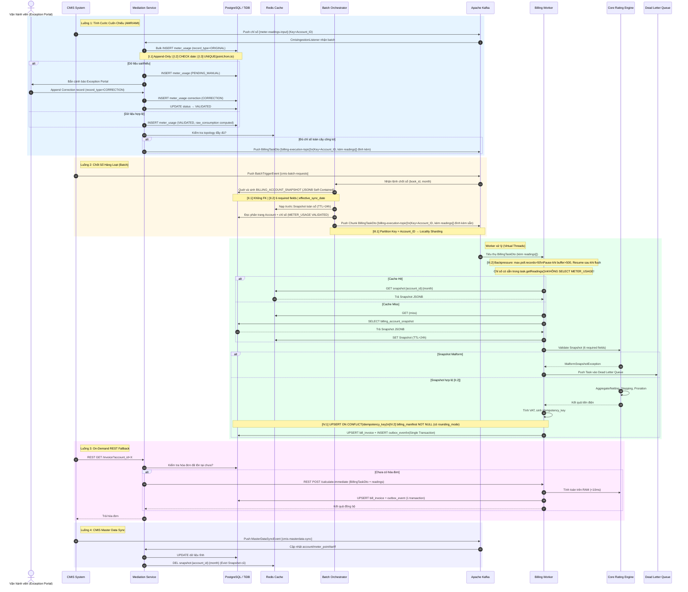

# Tài liệu Kiến trúc Hệ thống Tính cước & Thanh toán (Calculator Billing System)

- **Ngôn ngữ chính**: Java 17/21 & Spring Ecosystem
- **Mô hình kiến trúc**: Stateless Compute tách biệt Storage, Distributed Cache Layer, Event-Driven Pipeline, Transactional Outbox, Billing Snapshot (Đóng băng dữ liệu).

---

## I. MÔ HÌNH HOẠT ĐỘNG & KIẾN TRÚC TỔNG THỂ

Hệ thống từ bỏ tư duy hướng dữ liệu tập trung (Database-centric) để chuyển sang mô hình **Stateless Compute tách biệt Storage** kết hợp **Event-Driven Pipeline** và kiến trúc đóng băng dữ liệu (**Billing Snapshot**).

### 1. Đối tượng tính toán cốt lõi (Core Domain Entities)

- **Billing Account (Đơn vị tính toán thực thi)**:
  Mọi logic tính cước, cây quan hệ phụ tải, áp biểu giá bậc thang chỉ xảy ra bên trong phạm vi của một Billing Account. Một Account có thể sở hữu một hoặc nhiều điểm đo (Meter Points). Worker sẽ xử lý và tính toán hoàn toàn độc lập theo từng Account.
- **Mã Sổ (Book_ID - Đơn vị điều phối)**:
  Sổ không gánh logic nghiệp vụ tính toán mà đóng vai trò là một Phân vùng logic (Logical Partition). Hệ thống quản lý trạng thái, kích hoạt chu kỳ Batch, phân chia các phân đoạn dữ liệu (Chunking) và giám sát tiến độ hiển thị trên UI theo từng Mã Sổ.

### 2. Sơ sơ đồ kiến trúc phân lớp kỹ thuật (Hỗ trợ Cache & CDC Outbox)

```mermaid
flowchart TD
    subgraph Ingestion ["1. Mediation Layer (Tầng Thu Thập)"]
        AMI["AMR/AMI / Handheld Tools"] -->|Chỉ số ngày/cuối tháng| Med["Mediation Service (Spring Boot)"]
        Med -->|Hợp lệ| Usage[("Bảng METER_USAGE")]
        Med -->|Thiếu/Sai chỉ số| Pending["Trạng thái PENDING_MANUAL"]
        Pending -->|Nhập tay/Xác nhận| ExceptionUI["Exception UI / API"]
        ExceptionUI -->|Cập nhật VALIDATED| Usage
    end

    subgraph Snapshot ["2. Snapshot Generator (Đóng Băng Dữ Liệu)"]
        DB_Static[("Thông tin Hộ dân, Cây công tơ, Biểu giá")] -->|Quét tĩnh cuốn chiếu/CDC| Gen["Snapshot Generator"]
        Gen -->|Sinh BILLING_ACCOUNT_SNAPSHOT JSONB| SnapshotDB[("Bảng SNAPSHOT")]
        Gen -->|Lưu trước vào Cache| Redis[("Redis Cluster (Snapshot Cache)")]
    end

    subgraph Orchestration ["3. Batch Orchestrator (Điều Phối)"]
        Batch["Batch Orchestrator (Spring Batch Master)"] -->|Chia Chunk 1,000 Accounts| Kafka["Apache Kafka (Key = Account_ID)"]
    end

    subgraph Workers ["4. Distributed Workers (Xử Lý Phân Tán - Virtual Threads)"]
        Kafka -.->|billing-execution-topic| Worker1["Worker Node 1 (Spring Kafka Client)"]
        Kafka -.->|billing-execution-topic| WorkerN["Worker Node N (Spring Kafka Client)"]
        
        Worker1 -->|1. Đọc chỉ số| Usage
        Worker1 -->|2. Check Cache| Redis
        Redis -.->|Cache Miss| SnapshotDB
        Worker1 -->|3. Gọi Stateless Rating| Engine["Core Rating Engine (Pure Java)"]
        
        WorkerN -->|1. Đọc chỉ số| Usage
        WorkerN -->|2. Check Cache| Redis
        Redis -.->|Cache Miss| SnapshotDB
        WorkerN -->|3. Gọi Stateless Rating| Engine
    end

    subgraph Storage ["5. Storage Layer & Outbox (Lưu Trữ & Tích Hợp)"]
        Worker1 -->|BULK INSERT / UPSERT (Single Tx)| InvoiceDB[("Bảng BILL_INVOICE + outbox_event")]
        WorkerN -->|BULK INSERT / UPSERT (Single Tx)| InvoiceDB
        InvoiceDB -->|CDC Scan| Debezium["Debezium CDC Connector"]
        Debezium -->|Publish Event| KafkaOut["Kafka Downstream (invoice-events)"]
        KafkaOut -.->|Tiêu thụ bất đồng bộ| Downstream["Dịch vụ phụ (SMS, E-Invoice, Ledger)"]
    end

    classDef db fill:#e1f5fe,stroke:#0288d1,stroke-width:2px;
    classDef worker fill:#e8f5e9,stroke:#388e3c,stroke-width:2px;
    classDef broker fill:#fff3e0,stroke:#f57c00,stroke-width:2px;
    classDef cache fill:#ffebee,stroke:#c62828,stroke-width:2px;
    class Usage,SnapshotDB,InvoiceDB,DB_Static db;
    class Worker1,WorkerN worker;
    class Kafka,KafkaOut broker;
    class Redis cache;
```

---

## II. MA TRẬN CÔNG NGHỆ (JAVA BASED TECH STACK)

| Tầng chức năng | Công nghệ sử dụng | Vai trò & Cơ chế hoạt động |
| :--- | :--- | :--- |
| **Framework Chủ đạo** | Spring Boot 3.x & Spring Batch (Java 21 Virtual Threads) | Quản lý vòng đời ứng dụng, DI và cung cấp framework batch. Kích hoạt Virtual Threads để tối ưu hóa hiệu năng xử lý song song tác vụ I/O-bound. |
| **Hàng đợi thông điệp** | Apache Kafka (Spring Kafka) | Xương sống truyền thông điệp bất đồng bộ. Cấu hình Partition Key = `Account_ID` để bảo toàn thứ tự tính toán phụ tải. Cấu hình Static Membership tránh rebalance. |
| **Bộ nhớ đệm phân tán** | Redis Cluster | Lưu trữ tạm thời các snapshot tĩnh của hộ dân trong chu kỳ tính cước. Worker ưu tiên đọc snapshot từ Redis để triệt tiêu tải truy vấn SQL lên Database Cluster. |
| **Cơ sở dữ liệu (Storage)** | TiDB hoặc PostgreSQL Cluster (Citus) | Đảm bảo tính toàn vẹn giao dịch tài chính (ACID). Hỗ trợ kiểu dữ liệu `JSONB` hiệu năng cao và tự động phân vùng vật lý (Partitioning) theo tháng. |
| **Tích hợp Downstream** | Debezium CDC Connector | Quét log thay đổi ở bảng `outbox_event` để đẩy sự kiện gửi SMS/Email, Hóa đơn điện tử sang các downstream microservices một cách đáng tin cậy. |
| **Điều phối phân tán** | Kubernetes (K8s) & KEDA | Đóng gói Worker thành các Container Stateless. KEDA tự động scale-out số lượng Worker Pod từ 5 lên 100+ dựa trên chỉ số Kafka Lag Metric vào ngày cao điểm. |
| **Công cụ giám sát** | OpenTelemetry, Prometheus, Grafana | Thu thập Metrics, Tracing (Trace ID xuyên suốt từ chỉ số đến hóa đơn) và kiểm tra tốc độ xử lý hóa đơn thời gian thực. |

---

## III. CHI TIẾT CÁC MODULE CHỨC NĂNG TRONG HỆ THỐNG

Hệ thống được phân rã thành 6 Module Microservices/Sub-systems độc lập:

### 1. Module Thu thập & Chuẩn hóa (Mediation Sub-system)
- **Nhiệm vụ**: Tiếp nhận dữ liệu đo đếm thô từ CMIS qua Kafka topic `meter-readings-input`, hoặc từ AMR/AMI và thiết bị cầm tay Handheld.
- **Logic xử lý**: Lọc trùng (Deduplication theo Unique `meter_point_id + from_date + to_date`), xử lý Register Rollover, chuẩn hóa mốc thời gian.
- **Phép tính sơ bộ**: Tính toán và lưu sẵn `raw_consumption` vào bảng `METER_USAGE`:
  - Bình thường: $raw\_consumption = End\_Index - Start\_Index$
  - Quay vòng công tơ: $raw\_consumption = (max\_register - Start\_Index) + End\_Index$
- **Kích hoạt tính cước**: Sau khi lưu DB, Mediation kiểm tra tính đầy đủ topology (từ Redis Cache). Nếu đủ chỉ số cho toàn cây công tơ của Account, hàm `checkAndTriggerBillingWithReadings()` **đính kèm trực tiếp danh sách chỉ số vào Task tin nhắn** và đẩy vào Kafka topic `billing-execution-topic`. Worker nhận Task này **không cần SELECT lại DB** để lấy chỉ số.

```java
// Mediation Service — gửi Task kèm readings đã đính kèm sẵn
public void checkAndTriggerBillingWithReadings(
        String accountId, String month, List<MeterReadingDto> readings) {
    BillingTaskDto task = new BillingTaskDto(accountId, bookId, month, readings);
    // Partition Key = accountId → Locality Sharding (Ràng buộc III.1)
    kafkaTemplate.send("billing-execution-topic", accountId, task);
}
```

### 2. Cổng kiểm soát & Xử lý thủ công (Exception & Manual Entry Portal)
- **Nhiệm vụ**: Quản lý các điểm đo bị lỗi logic dữ liệu hoặc thiếu chỉ số cuối kỳ khi đến ngày chốt sổ.
- **Cơ chế**: Cô lập các tài khoản lỗi vào trạng thái `PENDING_MANUAL`. Nhân viên vận hành sửa chỉ số bằng cách **Append bản ghi Correction** (`record_type = 'CORRECTION'`) — tuyệt đối không UPDATE chỉ số thô gốc. Sau khi phê duyệt, trạng thái chuyển sang `VALIDATED` và kích hoạt lại pipeline.

### 3. Module Đóng băng dữ liệu & Caching (Snapshot Generator & Cache Sync)
- **Nhiệm vụ**: Đóng băng dữ liệu tĩnh (topology cây công tơ, biểu giá, định mức hộ) tại thời điểm chốt cước — cách ly hoàn toàn với các thay đổi tiếp theo trên CRM.
- **Cơ chế**:
  - **Luồng 2 (Batch)**: Batch Orchestrator sinh `BILLING_ACCOUNT_SNAPSHOT` (JSONB Self-Contained) cho toàn bộ Account trong Sổ, nạp trước lên Redis Cluster (TTL 24h).
  - **Luồng 4 (Master Data Sync)**: Khi CMIS thay đổi dữ liệu tĩnh (biểu giá, topology), Snapshot Generator lắng nghe Kafka `cmis-masterdata-sync` và tự động thu hồi (Evict) Snapshot cũ trên Redis.
  - Snapshot là **Read-Only** và **không có Foreign Key vật lý** tới bất kỳ bảng Master Data nào.

### 4. Bộ điều phối & Xử lý Batch phân tán (Distributed Master-Worker Cluster)
- **Master Node (Spring Batch)** — kích hoạt qua Kafka `cmis-batch-requests` từ CMIS:
  1. Nạp trước toàn bộ Snapshot của Sổ lên Redis.
  2. Đọc phân trang danh sách Account + chỉ số đo đếm tương ứng.
  3. Đóng gói `BillingTaskDto` (kèm sẵn `readings[]`) và đẩy vào Kafka `billing-execution-topic`.
- **Worker Nodes (Stateless, Virtual Threads)**: Tiêu thụ Task từ Kafka. **Worker KHÔNG thực hiện bất kỳ câu lệnh SELECT nào vào DB để đọc chỉ số** — toàn bộ chỉ số đã có sẵn trong `task.getReadings()`. Worker chỉ đọc Snapshot từ Redis (cache-aside) và thực hiện 1 thao tác Ghi duy nhất xuống DB sau khi tính toán xong.

### 5. Lõi định giá Vô trạng thái (Core Stateless Rating Engine)
- **Nhiệm vụ**: Module viết bằng Java thuần túy (Pure Java Object), hoàn toàn Stateless, không kết nối cơ sở dữ liệu để tối ưu tốc độ CPU.
- **Đầu vào**: `task.getReadings()` (chỉ số kèm sẵn) + Snapshot JSONB từ Redis.
- **Logic**: Thực thi cách tính toán qua DSL cho các loại giá: sinh hoạt bậc thang (Stepping), giá sản xuất/kinh doanh (Flat), giá TOU 3 pha và giá hỗn hợp composite. Hỗ trợ Proration khi đổi giá giữa kỳ.
- **Validate Snapshot**: Trước khi tính toán, Engine kiểm tra 6 required fields của Snapshot JSONB. Nếu thiếu bất kỳ field nào → ném `MalformSnapshotException` → Worker đẩy Task vào Dead Letter Queue (DLQ).

### 6. Module Đối soát, Kiểm toán & CDC Tích hợp (Audit & Integration Sub-system)
- **Nhiệm vụ**: Đảm bảo tính minh bạch pháp lý cao nhất cho hóa đơn và tự động tích hợp với các downstream service thông báo.
- **Cơ chế**: 
  - Xuất tệp giải trình `billing_manifest JSONB NOT NULL` đính kèm trực tiếp vào từng hóa đơn — chứa toàn bộ công thức toán học, bậc thang, `rounding_mode`.
  - Áp dụng **Transactional Outbox Pattern**: Lưu đồng thời hóa đơn vào `bill_invoice` và thông điệp sự kiện vào `outbox_event` trong cùng một transaction.
  - Sử dụng **Debezium CDC** quét bảng `outbox_event` (chỉ bản ghi `status = 'PENDING'`) đẩy sang Kafka `invoice-outbound` để CMIS và các dịch vụ phụ (SMS, E-Invoice...) tiêu thụ bất đồng bộ.

---

## IV. DATA FLOW CHI TIẾT END-TO-END (TỪ CÔNG TƠ ĐẾN HÓA ĐƠN)

Hệ thống vận hành theo **4 luồng độc lập**, tương ứng với 4 kịch bản nghiệp vụ:

### Kafka Topics Catalog

| Topic | Chiều | Mô tả |
|:---|:---:|:---|
| `meter-readings-input` | CMIS → Mediation | Chỉ số đo đếm thô từ AMR/AMI/Handheld |
| `cmis-batch-requests` | CMIS → Orchestrator | Lệnh chốt cước hàng loạt theo Mã Sổ |
| `cmis-masterdata-sync` | CMIS → Snapshot Gen | Thay đổi dữ liệu tĩnh (biểu giá, topology, hợp đồng) |
| `billing-execution-topic` | Orchestrator/Mediation → Worker | Task tính cước (kèm sẵn `readings[]`) |
| `invoice-outbound` | Debezium CDC → CMIS/Downstream | Hóa đơn đã tính xong, sự kiện SMS/E-Invoice |

---

### Luồng 1: Tính Cước Cuốn Chiếu Tự Động (Kafka Ingest)

Kịch bản: CMIS đẩy chỉ số AMR/AMI tự động hàng ngày.

1. CMIS đẩy chỉ số qua Kafka `meter-readings-input`. Mediation Service (`CmisIngestionListener`) nhận batch, kiểm duyệt và **bulk INSERT** vào `METER_USAGE` để lưu lịch sử.
2. Mediation kiểm tra tính đầy đủ topology từ Redis Cache. Nếu cây công tơ của Account đã có đủ chỉ số trong kỳ → gọi `checkAndTriggerBillingWithReadings()`: đính kèm `readings[]` vào `BillingTaskDto` và push vào Kafka `billing-execution-topic` với **Partition Key = Account_ID**.
3. Billing Worker nhận Task. **Chỉ số có sẵn trong `task.getReadings()` — Worker KHÔNG thực hiện SELECT vào METER_USAGE.** Worker đọc Snapshot từ Redis (cache-aside), tính toán Rating Engine trên RAM, ghi UPSERT `bill_invoice` + `outbox_event` trong 1 transaction.

### Luồng 2: Chốt Sổ Hàng Loạt (Spring Batch)

Kịch bản: CMIS gửi lệnh chốt sổ theo Mã Sổ vào cuối tháng.

1. CMIS đẩy `BatchTriggerEvent` vào Kafka `cmis-batch-requests`. Batch Orchestrator nhận, khởi chạy Spring Batch Job với `book_id` và `billing_cycle_month`.
2. **Freeze & Hydrate**: Orchestrator sinh `BILLING_ACCOUNT_SNAPSHOT` (JSONB Self-Contained) cho toàn bộ Account trong Sổ, nạp trước lên Redis Cluster (TTL 24h).
3. Orchestrator đọc phân trang danh sách Account + chỉ số đo đếm, đóng gói `BillingTaskDto` (kèm `readings[]`) và đẩy đồng loạt vào Kafka `billing-execution-topic` theo Chunk (Lô 1.000 Account).
4. Worker Nodes tiêu thụ song song. Do Partition Key = Account_ID, toàn bộ dữ liệu cùng Account luôn đi về cùng 1 Worker → tránh Race Condition. **Worker xử lý khép kín trên RAM, không phát sinh I/O Read DB.**

### Luồng 3: On-Demand Fallback (Đồng Bộ REST)

Kịch bản: Nhân viên vừa sửa chỉ số thủ công và cần xem hóa đơn tức thì từ CMIS.

1. CMIS gửi REST request đến Mediation Service. Mediation phát hiện hóa đơn chưa tồn tại → **bỏ qua hàng đợi Kafka**, gọi trực tiếp REST API `POST /calculate-immediate` trên Billing Worker.
2. Worker nhận `BillingTaskDto` (kèm readings), tính toán hoàn toàn trên RAM (**< 10ms**), ghi hóa đơn vào DB và trả về kết quả đồng bộ.
3. Vẫn đảm bảo tính nguyên tử: ghi đồng thời `bill_invoice`, `outbox_event`, `billing_calculation_log` trong 1 transaction.

### Luồng 4: Đồng Bộ Dữ Liệu Tĩnh (CMIS Master Data Sync)

Kịch bản: CMIS cập nhật biểu giá, topology cây công tơ, hoặc thông tin hợp đồng.

1. CMIS đẩy `MasterDataSyncEvent` vào Kafka `cmis-masterdata-sync`. Snapshot Generator lắng nghe, cập nhật các bảng dữ liệu tĩnh (`account`, `meter_point`, `tariff`, `meter_relation`).
2. Tự động thu hồi (Evict) Snapshot cũ trên Redis: `DEL snapshot:{account_id}:{billing_cycle_month}`. Lần tính cước tiếp theo sẽ tái sinh Snapshot mới với dữ liệu đã cập nhật.

---

### Giai đoạn 1: Thu thập và Kiểm duyệt dữ liệu đầu vào (Ingestion Phase)
1. CMIS/AMR/AMI hoặc Handheld Tool đẩy chỉ số về qua Kafka `meter-readings-input` hoặc API Gateway của Mediation Service.
2. Mediation kiểm tra:
   - Ràng buộc thời gian: `to_date > from_date`
   - Ràng buộc chỉ số: `end_index >= start_index` (hoặc kích hoạt Register Rollover nếu `end_index < start_index` và thỏa mãn `max_register_value`)
   - Deduplication: UNIQUE `(meter_point_id, from_date, to_date)` → reject trùng time-range
3. Nếu dữ liệu thiếu hoặc sai lệch → Ghi vào `METER_USAGE` trạng thái `PENDING_MANUAL`, bắn tín hiệu sang Exception Portal. Nhân viên sửa bằng cách **Append bản ghi Correction** (`record_type = 'CORRECTION'`) — tuyệt đối không UPDATE chỉ số gốc.
4. Nếu dữ liệu chuẩn xác → Tính `raw_consumption`, ghi vào `METER_USAGE` trạng thái `VALIDATED`.

### Giai đoạn 2: Đóng băng Dữ liệu tĩnh cấu hình (Freeze & Hydrate Phase)
1. Batch Master (kích hoạt từ Kafka `cmis-batch-requests`) phát lệnh sinh Snapshot cho toàn bộ Account thuộc `Book_ID`.
2. Hệ thống trích xuất topology, biểu giá (`GetTariffAt(billing_date)`), định mức, đóng gói thành JSONB Self-Contained và lưu vào `BILLING_ACCOUNT_SNAPSHOT` (`calculation_version = 1`, có `effective_sync_date`). Đồng thời nạp vào Redis Cache (TTL 24h).
3. **Snapshot không có Foreign Key vật lý** tới bất kỳ bảng Master Data nào — cách ly hoàn toàn với mọi thay đổi CRM sau thời điểm chốt.

### Giai đoạn 3: Tính toán cước Batch phân tán (Execution Phase)
1. Batch Master đóng gói `BillingTaskDto` (kèm sẵn `readings[]`) và đẩy vào Kafka `billing-execution-topic` với **Partition Key = Account_ID** (Ràng buộc Locality Sharding).
2. Worker Pods tiêu thụ đồng thời từ Kafka. Do Partition Key = Account_ID, mọi dữ liệu của 1 cụm phụ tải luôn về cùng 1 Worker → loại bỏ Race Condition.
3. **Worker nhận chỉ số từ `task.getReadings()` — không SELECT METER_USAGE.** Cơ chế Backpressure (`max.poll.records = 50`, Pause/Resume khi buffer > 500): ngăn OOM.
4. **Cache-aside Snapshot**: Worker đọc Snapshot từ Redis. Cache Miss → đọc DB và ghi ngược vào Redis.
5. **Validate Snapshot**: Kiểm tra 6 required fields (`account_id`, `book_id`, `norms_factor`, `effective_sync_date`, `meter_topology`, `tariffs`). Malform → DLQ.
6. Worker gọi `Core Rating Engine` tính cước bậc thang / Netting / Proration trên RAM.
7. Engine trả kết quả → Worker tính VAT, sinh `idempotency_key = account_id + billing_cycle_month + calculation_version`.
8. **Ghi nguyên tử (Transactional Outbox)**: UPSERT `bill_invoice` (ON CONFLICT idempotency_key) + INSERT `outbox_event` trong cùng 1 DB Transaction.

### Sơ đồ tuần tự luồng dữ liệu (Sequence Flow)




---

## V. KIẾN TRÚC DỮ LIỆU & CHI TIẾT SNAPSHOT SCHEMA (DATA LAYER)

Hệ thống sử dụng PostgreSQL Cluster (Citus) hoặc TiDB để phục vụ ghi tốc độ cao, với Range Partitioning theo tháng.

> **File SQL đầy đủ**: [`init-db/init.sql`](file:///Volumes/Code%201/caculator-billing-evncit/init-db/init.sql) — Schema v2.0 với 14 bảng, 4 nhóm ràng buộc kỹ thuật.

### 1. Sơ đồ các nhóm bảng

| Nhóm | Bảng | Mục đích | Đặc tính |
|---|---|---|---|
| **Master Data** | `meter_model`, `account`, `meter_point`, `meter_relation` | Dữ liệu tĩnh | ACID, shard by account_id |
| **Metadata/Rules** | `tariff`, `tariff_detail` | Biểu giá theo thời gian | `effective_date` + `expiry_date` |
| **Usage (Group I)** | `meter_usage` | Chỉ số công tơ | Append-Only, Partition/month |
| **Snapshot (Group II)** | `billing_account_snapshot` | Đóng băng cấu hình | No FK, Immutable, JSONB |
| **Output (Group IV)** | `bill_invoice` | Hóa đơn | Idempotency, Partition/month |
| **Integration** | `outbox_event`, `billing_calculation_log`, `book_billing_run`, `account_billing_status` | CDC & Audit | Outbox, Log, Control |

### 2. Các ràng buộc kỹ thuật cốt lõi

```sql
-- [I.1] Append-Only: sửa sai bằng Correction Record, không UPDATE chỉ số gốc
-- record_type = 'ORIGINAL' | 'CORRECTION'
-- correction_of_usage_id = soft FK tới bản ghi gốc

-- [I.2] Monotonically Increasing: những hàng nhập sai bị DB tự reject
CONSTRAINT chk_meter_usage_date_order CHECK (to_date > from_date)

-- [I.2] Register Rollover: đọc max_register_value từ meter_model
-- is_rollover = TRUE → consumption = (max_register_snapshot - start_index) + end_index

-- [I.3] Deduplication: 1 điểm đo, 1 khoảng thời gian — block ingestion trùng
CREATE UNIQUE INDEX uq_meter_usage_no_overlap
    ON meter_usage (meter_point_id, from_date, to_date);

-- [II.1] Snapshot cách ly vật lý: không có REFERENCES tới bất kỳ bảng Master Data
-- account_id VARCHAR(50) NOT NULL,  -- <— KHÔNG có REFERENCES account(account_id)

-- [II.2] Self-Containment: Worker validate 6 required fields trước khi tính toán
-- Nếu thiếu → MalformSnapshotException → Task bị đẩy vào DLQ

-- [IV.1] Idempotency: UPSERT ON CONFLICT — Kafka retry an toàn, không tạo hóa đơn trùng
INSERT INTO bill_invoice (..., idempotency_key, ...)
ON CONFLICT (idempotency_key)
DO UPDATE SET total_amount_after_tax = EXCLUDED.total_amount_after_tax,
              billing_manifest = EXCLUDED.billing_manifest,
              updated_at = NOW();

-- [IV.2] Self-Explainability: billing_manifest luôn đầy đủ, không NULL
billing_manifest JSONB NOT NULL  -- chứa: topology_calc, steps, rounding_mode, tax
```

### 3. Cấu trúc JSONB đồng băng (`config_data` trong Snapshot) [II.2 Self-Contained]

```json
{
  "account_id": "KH003",
  "book_id": "SO_01",
  "norms_factor": 3,
  "effective_sync_date": "2026-06-30",
  "meter_topology": {
    "root_points": [
      {
        "meter_point_id": "METER-03-TONG",
        "meter_serial": "SN-33300",
        "max_register_value": 9999999.9,
        "calculation_type": "AGGREGATION",
        "tariff_code": "TARIFF_SHBT_2023",
        "child_points": [
          {
            "meter_point_id": "METER-03-PHU",
            "meter_serial": "SN-33301",
            "max_register_value": 99999.9,
            "calculation_type": "NETTING",
            "tariff_code": "TARIFF_KDOANH_2023"
          }
        ]
      }
    ]
  },
  "tariffs": {
    "TARIFF_SHBT_2023": {
      "tariff_code": "TARIFF_SHBT_2023",
      "type": "STEPPING",
      "effective_date": "2023-05-04",
      "expiry_date": null,
      "blocks": [
        {"step": 1, "min_kwh": 0,   "max_kwh": 50,  "unit_price": 1806},
        {"step": 2, "min_kwh": 50,  "max_kwh": 100, "unit_price": 1866},
        {"step": 3, "min_kwh": 100, "max_kwh": 200, "unit_price": 2167},
        {"step": 4, "min_kwh": 200, "max_kwh": 300, "unit_price": 2729},
        {"step": 5, "min_kwh": 300, "max_kwh": 400, "unit_price": 3050},
        {"step": 6, "min_kwh": 400, "max_kwh": null,"unit_price": 3157}
      ]
    },
    "TARIFF_KDOANH_2023": {
      "tariff_code": "TARIFF_KDOANH_2023",
      "type": "FLAT",
      "effective_date": "2023-05-04",
      "expiry_date": null,
      "blocks": [
        {"step": 1, "min_kwh": 0, "max_kwh": null, "unit_price": 2500}
      ]
    }
  },
  "proration_periods": []
}
```

### 4. Cấu trúc `billing_manifest` JSONB [IV.2 Self-Explainability]

```json
{
  "invoice_id": "INV-EVN-202607-KH003",
  "calculation_engine_version": "v2.1-stable",
  "timestamp": "2026-07-07T00:00:00Z",
  "snapshot_applied": "KH003_2026_07_v1",
  "topology_calculation": {
    "input_readings": [
      {
        "meter_point_id": "METER-03-TONG",
        "calculation_type": "AGGREGATION",
        "sub_readings": [
          {"seq": 1, "from_date": "2026-07-01", "to_date": "2026-07-31",
           "start_index": 2000, "end_index": 2500, "is_rollover": false, "kwh": 500}
        ],
        "total_kwh": 500
      },
      {
        "meter_point_id": "METER-03-PHU",
        "calculation_type": "NETTING",
        "sub_readings": [
          {"seq": 1, "from_date": "2026-07-01", "to_date": "2026-07-31",
           "start_index": 500, "end_index": 600, "is_rollover": false, "kwh": 100}
        ],
        "total_kwh": 100
      }
    ],
    "net_consumption_formula": "AGGREGATION(500) - NETTING(100) = 400 kWh",
    "final_net_consumption": 400,
    "norms_factor": 3
  },
  "proration": null,
  "rating_breakdown": {
    "tariff_applied": "TARIFF_SHBT_2023",
    "tariff_effective_date": "2023-05-04",
    "steps_executed": [
      {"step": 1, "range_kwh": "0-150",   "kwh": 150, "unit_price": 1806, "amount": 270900,
       "note": "Bậc 1 × norms_factor(3) = 0-150 kWh"},
      {"step": 2, "range_kwh": "150-300", "kwh": 150, "unit_price": 1866, "amount": 279900,
       "note": "Bậc 2 × norms_factor(3) = 150-300 kWh"},
      {"step": 3, "range_kwh": "300-400", "kwh": 100, "unit_price": 2167, "amount": 216700,
       "note": "Bậc 3 = 300-400 kWh"}
    ],
    "total_before_tax": 767500
  },
  "tax_calculation": {
    "vat_rate": 0.10,
    "tax_amount_raw": 76750,
    "rounding_mode": "HALF_UP",
    "tax_amount_final": 76750
  },
  "total_final_amount": 844250
}
```


---

## VI. CHI TIẾT THUẬT TOÁN ĐẶC THÙ NGÀNH ĐIỆN (CORE JAVA RATING LOGIC)

### 1. Thuật toán Xử lý Cây Công tơ Phụ tải (Netting & Aggregation)

Trước khi đưa số liệu sản lượng đi tính tiền, `Core Rating Engine` duyệt cây cấu trúc `meter_topology` lưu trong Snapshot JSONB để tính toán ra Sản lượng điện thực tế cuối cùng thương phẩm ($\text{Net Consumption}$):
- Các điểm đo cấu hình kiểu `AGGREGATION` (Cộng tổng) $\rightarrow$ Cộng sản lượng vào tổng chung.
- Các điểm đo cấu hình kiểu `NETTING` (Trừ phụ tải con dùng riêng) $\rightarrow$ Trừ bớt sản lượng ra khỏi tổng chung.

Công thức tổng quát:
$$\text{Net Consumption} = \sum \text{Consumption}_{\text{Aggregation}} - \sum \text{Consumption}_{\text{Netting}}$$

### 2. Thuật toán Biểu giá Bậc thang Sinh hoạt Nhân định mức hộ dùng chung

Khi một công tơ được cấp cho nhiều hộ dùng chung (ví dụ nhà thuê, khu tập thể), biểu giá bậc thang phải được nhân tỷ lệ với hệ số định mức hộ (`norms_factor`):

Công thức điều chỉnh khoảng bậc:
$$\text{Adjusted Min} = \text{Default Min} \times \text{norms\_factor}$$
$$\text{Adjusted Max} = \text{Default Max} \times \text{norms\_factor}$$

*Ví dụ*: Nếu `norms_factor = 3`, khoảng bậc 1 tiêu chuẩn từ $[0 - 50 \text{ kWh}]$ sẽ tự động mở rộng thành từ $[0 - 150 \text{ kWh}]$ áp mức đơn giá 1806 đ/kWh.

### 3. Thuật toán Nội suy Tỷ lệ khi Thay đổi Giá Giữa kỳ (Proration Mode)

Khi Nhà nước ban hành quy định tăng/giảm giá điện vào giữa chu kỳ tính hóa đơn (ví dụ ngày 15 tăng giá trong chu kỳ tính từ ngày 01 đến ngày 30):
- **Phân tách Thời gian**: Tính tổng số ngày trong kỳ ($T_{\text{Total}} = T_{\text{Old}} + T_{\text{New}}$).
- **Nội suy Sản lượng**: Chia nhỏ sản lượng điện tiêu thụ tổng ($Net\_Consumption$) thành các phần tỷ lệ thuận theo thời gian thực tế sử dụng:
  $$\text{Consumption}_{\text{Kỳ giá cũ}} = \text{Net Consumption} \times \left( \frac{T_{\text{Old}}}{T_{\text{Total}}} \right)$$
  $$\text{Consumption}_{\text{Kỳ giá mới}} = \text{Net Consumption} \times \left( \frac{T_{\text{New}}}{T_{\text{Total}}} \right)$$
- **Rating Độc lập**: Đẩy hai lượng điện vừa chia vào Rating Engine chạy song song với 2 cấu hình phiên bản luật biểu giá tương ứng.
- **Hợp nhất cấu phần**: Cộng kết quả tiền của hai giai đoạn thành số tiền cuối cùng của Hóa đơn tổng và ghi vết rõ ràng 2 cấu phần này vào trường giải trình `billing_manifest`.

---

## VII. CHI TIẾT BIỆN PHÁP SCALABILITY, PERFORMANCE & OBSERVALBILITY

### 1. Cơ cơ chế Kiểm soát Áp lực ngược (Backpressure Handling)

Worker tiêu thụ thông điệp tính toán từ Kafka sẽ được thiết lập cơ chế kiểm soát lưu lượng bằng cấu hình Spring Kafka. 
Nếu Database phân tán gặp hiện tượng quá tải tốc độ ghi (Write Path Bottleneck), Worker Client tự động kích hoạt trạng thái **Pause Poll** để tạm ngưng kéo thêm Task mới từ Kafka Queue. Worker tập trung dọn dẹp các lô dữ liệu tính toán đang nằm chờ trong bộ nhớ RAM, thực thi Bulk Ghi xuống DB thành công rồi mới tiếp tục gọi lệnh **Resume Poll** kéo dữ liệu tiếp theo. Cơ chế này loại bỏ 100% rủi ro lỗi tràn bộ nhớ (OOM - Out Of Memory) của hệ thống Workers.

### 2. Nguyên tắc Bất biến (Immutability) & Tính Độc lập Không trùng lặp (Idempotency)

- **Immutability (Tính bất biến)**: Bản ghi dữ liệu cấu hình đóng băng `BILLING_ACCOUNT_SNAPSHOT` tuân thủ nguyên tắc bất biến tuyệt đối, không được sử dụng lệnh `UPDATE` sửa đổi dữ liệu sau khi đã sinh ra cho chu kỳ tháng đó. Nếu phát hiện lỗi nghiệp vụ (nhập sai biểu giá gốc), quy trình chuẩn là hủy snapshot, cấu hình lại hệ thống và sinh snapshot mới tăng số phiên bản `calculation_version = 2`.
- **Idempotency (Tính độc trị/chống trùng lặp)**: Mỗi hóa đơn ghi nhận xuống DB bắt buộc phải đi kèm khóa `idempotency_key = account_id + billing_cycle_month + calculation_version`. Worker ghi dữ liệu xuống Storage bằng cú pháp `UPSERT` (`On Conflict Do Update`). Nếu hệ thống gặp sự cố mất kết nối mạng giữa chừng, việc Kafka đẩy lại Task (Retry) sẽ chỉ thực hiện ghi đè dữ liệu hóa đơn một cách an toàn, tuyệt đối không bao giờ sinh ra hóa đơn rác hoặc tính tiền hai lần cho cùng một khách hàng.

### 3. Cấu trúc vết kiểm toán mẫu (`billing_manifest` trong bảng Invoice)

Trường JSONB này cho phép bộ phận chăm sóc khách hàng (CSKH) có thể giải trình tường nhận quy trình toán học tính ra số tiền điện cho khách hàng mà không cần truy vết log hệ thống phức tạp:

```json
{
  "invoice_id": "INV-EVN-202606-88899",
  "audit_trail": {
    "engine_version": "v3.2.1-prod",
    "execution_timestamp": "2026-06-29T23:15:00Z",
    "snapshot_applied": "SNAPSHOT-ACC-EVN-123456-2026_06-v1"
  },
  "topology_calculation": {
    "input_readings": [
      {"meter_point_id": "METER-TONG-01", "type": "AGGREGATION", "kwh": 420.00},
      {"meter_point_id": "METER-PHU-02", "type": "NETTING", "kwh": 20.00}
    ],
    "final_net_consumption": 400.00
  },
  "rating_breakdown": {
    "tariff_applied": "TARIFF_SHBT_2026",
    "norms_factor_applied": 3,
    "steps_executed": [
      {
        "step": 1,
        "kwh_consumed": 150.00,
        "unit_price": 1806,
        "amount": 270900.00,
        "note": "Mở rộng định mức bậc (50kwh * 3 hộ)"
      },
      {
        "step": 2,
        "kwh_consumed": 150.00,
        "unit_price": 1866,
        "amount": 279900.00,
        "note": "Mở rộng định mức bậc (50kwh * 3 hộ)"
      },
      {
        "step": 3,
        "kwh_consumed": 100.00,
        "unit_price": 2167,
        "amount": 216700.00,
        "note": "Sản lượng còn lại rơi vào bậc 3"
      }
    ],
    "total_before_tax": 767500.00
  }
}
```

### 4. Cấu hình tối ưu hiệu năng cụ thể (Performance Configurations)

Nhằm tối ưu hóa hiệu năng trên mọi phương diện của luồng Batch, hệ thống được cấu hình dựa trên các quy chuẩn kỹ thuật sau:

#### A. Kích hoạt Virtual Threads (Java 21 / Spring Boot 3.x)
Cấu hình Spring Boot cho phép chạy song song hàng nghìn thread nhẹ xử lý I/O DB mà không làm nghẽn hoặc cạn kiệt tài nguyên máy chủ:
```yaml
spring:
  threads:
    virtual:
      enabled: true
```

#### B. Kafka Static Membership tránh Rebalance khi Auto-scaling (KEDA)
Tránh việc Kafka ngừng hoạt động của toàn bộ Consumer Group (Stop-the-world) khi KEDA thực hiện Scale-out/Scale-in nhanh chóng các Worker Pod:
```properties
# Gán mã định danh tĩnh cho mỗi Pod Worker dựa trên Hostname vật lý của Kubernetes
spring.kafka.consumer.properties.group.instance.id=worker-pod-${HOSTNAME}
# Tăng thời gian timeout để Kafka Broker giữ partition khi Worker tạm thời mất kết nối
spring.kafka.consumer.properties.session.timeout.ms=30000
# Sử dụng cơ chế phân chia partition sticky, giảm thiểu xáo trộn
spring.kafka.consumer.properties.partition.assignment.strategy=org.apache.kafka.clients.consumer.CooperativeStickyAssignor
```

#### C. Chiến lược ghi đệm Redis Cache cho Snapshot
- **Key Format**: `snapshot:{account_id}:{billing_cycle_month}`
- **TTL (Time to Live)**: 24 giờ. Cơ chế tự động giải phóng bộ nhớ đệm sau khi kết thúc chu kỳ tính cước của Sổ.

---

## VIII. KẾ HOẠCH TRIỂN KHAI CHI TIẾT (IMPLEMENTATION LỘ TRÌNH)

Kế hoạch xây dựng hệ thống cùng Agent được thiết kế theo mô hình cuốn chiếu 5 giai đoạn chạy độc lập:

- [ ] **Giai đoạn 1 (Thiết kế Data Layer)**: Triển khai khởi tạo toàn bộ cấu trúc bảng vật lý SQL (PostgreSQL/TiDB) bao gồm cấu hình Partition theo tháng, cấu trúc JSONB cho Snapshot và bảng tích hợp `outbox_event`.
- [ ] **Giai đoạn 2 (Xây dựng Ingestion Pipeline)**: Lập trình module Spring Boot Mediation Service nhận thông điệp chỉ số, lọc trùng, tính toán sản lượng và thiết lập trạng thái `PENDING_MANUAL` xử lý thủ công qua cổng UI Exception Portal.
- [ ] **Giai đoạn 3 (Lập trình Lõi Core Tính toán)**: Viết class `RatingEngine` bằng Java thuần túy xử lý toàn bộ các thuật toán phân rã cây công tơ, nhân định mức số hộ và cơ chế Proration chia nhỏ ngày khi đổi giá điện.
- [ ] **Giai đoạn 4 (Xây dựng Batch Master-Worker & Caching)**: Phát triển bộ API Master sinh dữ liệu đóng băng Snapshot tĩnh vào DB và đồng bộ lên Redis Cluster làm Cache Layer. Cài đặt các Worker sử dụng Java 21 Virtual Threads tiêu thụ song song từ Kafka (áp dụng Static Membership), đọc Snapshot ưu tiên từ Redis (Cache-aside) và ghi kết quả xuống DB sử dụng Transactional Outbox.
- [ ] **Giai đoạn 5 (Cơ chế An toàn, Giám sát & Tích hợp)**: Thiết lập CDC Connector (Debezium/Kafka Connect) đọc từ bảng `outbox_event` để tự động đẩy sự kiện đến các Downstream Services (SMS, Hóa đơn điện tử, Sổ sách...). Hoàn thiện cấu hình luồng DLQ cô lập lỗi và hệ thống Prometheus/Grafana giám sát thời gian thực.
