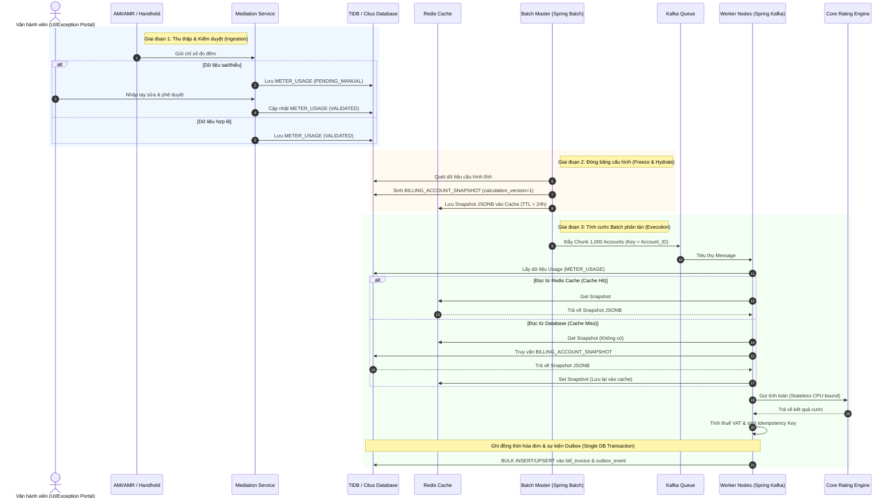

# Tài liệu Kiến trúc Hệ thống Tính cước & Thanh toán (Calculator Billing System)

- **Ngôn ngữ chính**: Java 17/21 & Spring Ecosystem
- **Mô hình kiến trúc**: Stateless Compute tách biệt Storage, Distributed Cache Layer, Event-Driven Pipeline, Transactional Outbox, Billing Snapshot (Đóng băng dữ liệu).

---

## I. MÔ HÌNH HOẠT ĐỘNG & KIẾN TRÚC TỔNG THỂ

Hệ thống từ bỏ tư duy hướng dữ liệu tập trung (Database-centric) để chuyển sang mô hình **Stateless Compute tách biệt Storage** kết hợp **Event-Driven Pipeline** và kiến trúc đóng băng dữ liệu (**Billing Snapshot**).

### 1. Đối tượng tính toán cốt lõi (Core Domain Entities)

- **Billing Account (Đơn vị tính toán thực thi)**:
  Mọi logic tính cước, cây quan hệ phụ tải, áp biểu giá bậc thang chỉ xảy ra bên trong phạm vi của một Billing Account. Một Account có thể sở hữu một hoặc nhiều điểm đo (Meter Points). Worker sẽ xử lý và tính toán hoàn toàn độc lập theo từng Account.
- **Mã Sổ (Book_ID - Đơn vị điều phối)**:
  Sổ không gánh logic nghiệp vụ tính toán mà đóng vai trò là một Phân vùng logic (Logical Partition). Hệ thống quản lý trạng thái, kích hoạt chu kỳ Batch, phân chia các phân đoạn dữ liệu (Chunking) và giám sát tiến độ hiển thị trên UI theo từng Mã Sổ.

### 2. Sơ sơ đồ kiến trúc phân lớp kỹ thuật (Hỗ trợ Cache & CDC Outbox)

```mermaid
flowchart TD
    subgraph Ingestion ["1. Mediation Layer (Tầng Thu Thập)"]
        AMI["AMR/AMI / Handheld Tools"] -->|Chỉ số ngày/cuối tháng| Med["Mediation Service (Spring Boot)"]
        Med -->|Hợp lệ| Usage[("Bảng METER_USAGE")]
        Med -->|Thiếu/Sai chỉ số| Pending["Trạng thái PENDING_MANUAL"]
        Pending -->|Nhập tay/Xác nhận| ExceptionUI["Exception UI / API"]
        ExceptionUI -->|Cập nhật VALIDATED| Usage
    end

    subgraph Snapshot ["2. Snapshot Generator (Đóng Băng Dữ Liệu)"]
        DB_Static[("Thông tin Hộ dân, Cây công tơ, Biểu giá")] -->|Quét tĩnh cuốn chiếu/CDC| Gen["Snapshot Generator"]
        Gen -->|Sinh BILLING_ACCOUNT_SNAPSHOT JSONB| SnapshotDB[("Bảng SNAPSHOT")]
        Gen -->|Lưu trước vào Cache| Redis[("Redis Cluster (Snapshot Cache)")]
    end

    subgraph Orchestration ["3. Batch Orchestrator (Điều Phối)"]
        Batch["Batch Orchestrator (Spring Batch Master)"] -->|Chia Chunk 1,000 Accounts| Kafka["Apache Kafka (Key = Account_ID)"]
    end

    subgraph Workers ["4. Distributed Workers (Xử Lý Phân Tán - Virtual Threads)"]
        Kafka -.->|billing-execution-topic| Worker1["Worker Node 1 (Spring Kafka Client)"]
        Kafka -.->|billing-execution-topic| WorkerN["Worker Node N (Spring Kafka Client)"]
        
        Worker1 -->|1. Đọc chỉ số| Usage
        Worker1 -->|2. Check Cache| Redis
        Redis -.->|Cache Miss| SnapshotDB
        Worker1 -->|3. Gọi Stateless Rating| Engine["Core Rating Engine (Pure Java)"]
        
        WorkerN -->|1. Đọc chỉ số| Usage
        WorkerN -->|2. Check Cache| Redis
        Redis -.->|Cache Miss| SnapshotDB
        WorkerN -->|3. Gọi Stateless Rating| Engine
    end

    subgraph Storage ["5. Storage Layer & Outbox (Lưu Trữ & Tích Hợp)"]
        Worker1 -->|BULK INSERT / UPSERT (Single Tx)| InvoiceDB[("Bảng BILL_INVOICE + outbox_event")]
        WorkerN -->|BULK INSERT / UPSERT (Single Tx)| InvoiceDB
        InvoiceDB -->|CDC Scan| Debezium["Debezium CDC Connector"]
        Debezium -->|Publish Event| KafkaOut["Kafka Downstream (invoice-events)"]
        KafkaOut -.->|Tiêu thụ bất đồng bộ| Downstream["Dịch vụ phụ (SMS, E-Invoice, Ledger)"]
    end

    classDef db fill:#e1f5fe,stroke:#0288d1,stroke-width:2px;
    classDef worker fill:#e8f5e9,stroke:#388e3c,stroke-width:2px;
    classDef broker fill:#fff3e0,stroke:#f57c00,stroke-width:2px;
    classDef cache fill:#ffebee,stroke:#c62828,stroke-width:2px;
    class Usage,SnapshotDB,InvoiceDB,DB_Static db;
    class Worker1,WorkerN worker;
    class Kafka,KafkaOut broker;
    class Redis cache;
```

---

## II. MA TRẬN CÔNG NGHỆ (JAVA BASED TECH STACK)

| Tầng chức năng | Công nghệ sử dụng | Vai trò & Cơ chế hoạt động |
| :--- | :--- | :--- |
| **Framework Chủ đạo** | Spring Boot 3.x & Spring Batch (Java 21 Virtual Threads) | Quản lý vòng đời ứng dụng, DI và cung cấp framework batch. Kích hoạt Virtual Threads để tối ưu hóa hiệu năng xử lý song song tác vụ I/O-bound. |
| **Hàng đợi thông điệp** | Apache Kafka (Spring Kafka) | Xương sống truyền thông điệp bất đồng bộ. Cấu hình Partition Key = `Account_ID` để bảo toàn thứ tự tính toán phụ tải. Cấu hình Static Membership tránh rebalance. |
| **Bộ nhớ đệm phân tán** | Redis Cluster | Lưu trữ tạm thời các snapshot tĩnh của hộ dân trong chu kỳ tính cước. Worker ưu tiên đọc snapshot từ Redis để triệt tiêu tải truy vấn SQL lên Database Cluster. |
| **Cơ sở dữ liệu (Storage)** | TiDB hoặc PostgreSQL Cluster (Citus) | Đảm bảo tính toàn vẹn giao dịch tài chính (ACID). Hỗ trợ kiểu dữ liệu `JSONB` hiệu năng cao và tự động phân vùng vật lý (Partitioning) theo tháng. |
| **Tích hợp Downstream** | Debezium CDC Connector | Quét log thay đổi ở bảng `outbox_event` để đẩy sự kiện gửi SMS/Email, Hóa đơn điện tử sang các downstream microservices một cách đáng tin cậy. |
| **Điều phối phân tán** | Kubernetes (K8s) & KEDA | Đóng gói Worker thành các Container Stateless. KEDA tự động scale-out số lượng Worker Pod từ 5 lên 100+ dựa trên chỉ số Kafka Lag Metric vào ngày cao điểm. |
| **Công cụ giám sát** | OpenTelemetry, Prometheus, Grafana | Thu thập Metrics, Tracing (Trace ID xuyên suốt từ chỉ số đến hóa đơn) và kiểm tra tốc độ xử lý hóa đơn thời gian thực. |

---

## III. CHI TIẾT CÁC MODULE CHỨC NĂNG TRONG HỆ THỐNG

Hệ thống được phân rã thành 6 Module Microservices/Sub-systems độc lập:

### 1. Module Thu thập & Chuẩn hóa (Mediation Sub-system)
- **Nhiệm vụ**: Tiếp nhận dữ liệu đo đếm thô từ hệ thống AMR/AMI (đẩy theo ngày) hoặc thiết bị cầm tay Handheld (đẩy cuối tháng).
- **Logic xử lý**: Lọc trùng (Deduplication), chuẩn hóa mốc thời gian "Từ ngày - Đến ngày".
- **Phép tính sơ bộ**: Thực hiện kiểm tra tính toàn vẹn và tính toán sẵn sản lượng tiêu thụ trong kỳ:
  $$Consumption = End\_Index - Start\_Index$$

### 2. Cổng kiểm soát & Xử lý thủ công (Exception & Manual Entry Portal)
- **Nhiệm vụ**: Quản lý các điểm đo bị lỗi logic dữ liệu hoặc thiếu chỉ số cuối kỳ khi đến ngày chốt sổ.
- **Cơ chế**: Cô lập các tài khoản lỗi vào trạng thái `PENDING_MANUAL`. Cung cấp giao diện UI/API cho nhân viên vận hành nhập chỉ số bổ sung bằng tay, phê duyệt tập trung trước khi chuyển trạng thái sang `VALIDATED` để đưa lại vào pipeline tính toán.

### 3. Module Đóng băng dữ liệu & Caching (Snapshot Generator & Cache Sync)
- **Nhiệm vụ**: Giải quyết triệt để bài toán thắt nút cổ chai (Bottleneck) khi truy vấn DB liên tục lúc chạy batch.
- **Cơ chế**: Quét thông tin tĩnh (Thông tin khách hàng, cấu trúc cây công tơ phụ tải Aggregation/Netting, tỷ lệ % phân bổ giá hỗn hợp, định mức hộ dùng chung) cuốn chiếu. Gom tất cả thành một chuỗi JSONB duy nhất lưu vào bảng `BILLING_ACCOUNT_SNAPSHOT` và đồng bộ trước lên **Redis Cluster** làm Cache. Trong suốt quá trình chạy Batch, Worker ưu tiên đọc duy nhất file Snapshot từ Redis.

### 4. Bộ điều phối & Xử lý Batch phân tán (Distributed Master-Worker Cluster)
- **Master Node (Spring Batch)**: Chịu trách nhiệm quản lý vòng đời trạng thái của Sổ. Thực hiện chia nhỏ danh sách Account cần tính cước thành các Lô dữ liệu (Chunk size = 1,000 Accounts) và gửi tín hiệu vào Kafka topic.
- **Worker Nodes (Stateless Java Spring Kafka Clients - Virtual Threads)**: Lắng nghe sự kiện từ Kafka, lấy chỉ số đo từ `METER_USAGE` và cấu hình từ Redis Cache (nếu miss thì đọc DB), gọi qua `Core Rating Engine` để tính toán song song sử dụng luồng ảo (Virtual Threads).

### 5. Lõi định giá Vô trạng thái (Core Stateless Rating Engine)
- **Nhiệm vụ**: Module viết bằng Java thuần túy (Pure Java Object), hoàn toàn Stateless, không kết nối cơ sở dữ liệu để tối ưu tốc độ CPU.
- **Đầu vào**: Nhận vào số liệu sản lượng thực tế và cấu trúc biểu giá động trích xuất từ Snapshot JSONB.
- **Logic**: Thực thi cách tính toán cấu hình qua DSL (Domain Specific Language) cho các loại giá: sinh hoạt bậc thang, giá sản xuất, kinh doanh, giá TOU và giá hỗn hợp composite.

### 6. Module Đối soát, Kiểm toán & CDC Tích hợp (Audit & Integration Sub-system)
- **Nhiệm vụ**: Đảm bảo tính minh bạch pháp lý cao nhất cho hóa đơn và tự động tích hợp với các downstream service thông báo.
- **Cơ chế**: 
  - Xuất tệp giải trình `billing_manifest` dạng JSON đính kèm trực tiếp vào từng hóa đơn.
  - Áp dụng **Transactional Outbox Pattern**: Lưu đồng thời hóa đơn vào `bill_invoice` và thông điệp sự kiện vào `outbox_event` trong cùng một transaction.
  - Sử dụng **Debezium CDC** quét bảng `outbox_event` đẩy sang Kafka để các dịch vụ phụ (SMS, E-Invoice...) tiêu thụ bất đồng bộ.

---

## IV. DATA FLOW CHI TIẾT END-TO-END (TỪ CÔNG TƠ ĐẾN HÓA ĐƠN)

Luồng đi của dữ liệu hệ thống trải qua 3 giai đoạn độc lập tuyệt đối:

### Giai đoạn 1: Thu thập và Kiểm duyệt dữ liệu đầu vào (Ingestion Phase)
1. Hệ thống AMR/AMI hoặc Handheld Tool đẩy chỉ số về qua API Gateway của Mediation Service.
2. Mediation Service kiểm tra logic chỉ số mới không được nhỏ hơn chỉ số cũ (trừ trường hợp công tơ quay vòng hoặc thay cháy thiết bị).
3. Nếu dữ liệu thiếu hoặc sai lệch $\rightarrow$ Bản ghi ghi vào bảng `METER_USAGE` trạng thái `PENDING_MANUAL`, đồng thời bắn tín hiệu sang giao diện Exception Portal. Người dùng nhập tay sửa chỉ số $\rightarrow$ API cập nhật lại trạng thái thành `VALIDATED`.
4. Nếu dữ liệu chuẩn xác $\rightarrow$ Tính toán sẵn sản lượng ($Cuối\ kỳ - Đầu\ kỳ$), ghi vào bảng `METER_USAGE` với trạng thái `VALIDATED`.

### Giai đoạn 2: Đóng băng Dữ liệu tĩnh cấu hình (Freeze & Hydrate Phase)
1. Đến ngày chốt sổ theo lịch (Billing Cycle Trigger), Batch Master phát lệnh đóng băng cho toàn bộ các Account thuộc `Book_ID` đó.
2. Hệ thống trích xuất thông tin cây quan hệ điểm đo phụ tải, mã biểu giá áp dụng, định mức hộ dùng chung tại đúng thời điểm đó, đóng gói thành cấu trúc JSONB và lưu vào bảng `BILLING_ACCOUNT_SNAPSHOT` với phiên bản tính toán mặc định `calculation_version = 1`. Đồng thời lưu bản ghi này vào Redis Cache với thời hạn lưu trữ (TTL) 24h.

### Giai đoạn 3: Tính toán cước Batch phân tán (Execution Phase)
1. Batch Master chia tách danh sách Account cần tính cước theo các Chunk (Lô 1,000 Account) và gửi message vào Kafka topic `billing-execution-topic` với Key = `Account_ID`.
2. Các Worker Pods tiêu thụ tin nhắn đồng thời từ Kafka Partition. Do Key là `Account_ID`, toàn bộ dữ liệu của một hộ gia đình hoặc một cụm phụ tải có quan hệ trừ phụ phức tạp luôn đi về cùng một Worker duy nhất, tránh hoàn toàn lỗi Race Condition (Xung đột ghi).
3. Worker thực hiện truy vấn nhanh local partition của bảng `METER_USAGE` để lấy dữ liệu chỉ số.
4. **Kiểm tra Cache (Cache-aside)**: Worker tìm kiếm Snapshot trong Redis Cluster:
   - *Nếu Cache Hit*: Lấy trực tiếp dữ liệu Snapshot JSONB từ Redis.
   - *Nếu Cache Miss*: Truy vấn bảng `BILLING_ACCOUNT_SNAPSHOT` trong DB, sau đó ghi cập nhật ngược lại vào Redis.
5. Worker truyền dữ liệu vào `Core Rating Engine` để thực thi tính cước bậc thang hoặc giá hỗn hợp.
6. Engine trả về kết quả tài chính $\rightarrow$ Worker thực hiện áp thuế VAT, sinh mã kiểm soát chống trùng lặp `idempotency_key = account_id + billing_cycle_month + calculation_version`.
7. **Ghi dữ liệu nguyên tử (Transactional Outbox)**: Worker thực thi lệnh ghi đồng thời theo lô xuống bảng `bill_invoice` và bảng sự kiện `outbox_event` trong cùng một Database Transaction.

### Sơ đồ tuần tự luồng dữ liệu (Sequence Flow)



---

## V. KIẾN TRÚC DỮ LIỆU & CHI TIẾT SNAPSHOT SCHEMA (DATA LAYER)

Hệ thống sử dụng cơ sở dữ liệu phân tán (Distributed SQL như TiDB hoặc cụm PostgreSQL phân mảnh Citus) để phục vụ việc ghi tốc độ cao.

### 1. Cấu trúc vật lý các bảng lõi (Database Schema DDL)

Dưới đây là đặc tả SQL DDL chuẩn hóa phù hợp cho TiDB / PostgreSQL Cluster hỗ trợ phân vùng vật lý (Range Partition) theo tháng và tích hợp bảng sự kiện Outbox:

```sql
-- 1. Bảng: account (Bảng cấu hình chính)
CREATE TABLE account (
    account_id VARCHAR(50) PRIMARY KEY,
    book_id VARCHAR(20) NOT NULL,
    customer_name VARCHAR(100) NOT NULL,
    status VARCHAR(20) NOT NULL DEFAULT 'ACTIVE'
);
CREATE INDEX idx_account_book ON account(book_id);

-- 2. Bảng: meter_usage (Phân vùng theo tháng - Range Partition)
CREATE TABLE meter_usage (
    usage_id BIGINT NOT NULL,
    account_id VARCHAR(50) NOT NULL,
    meter_point_id VARCHAR(50) NOT NULL,
    billing_cycle_month VARCHAR(10) NOT NULL, -- Định dạng: YYYY_MM
    from_date TIMESTAMP NOT NULL,
    to_date TIMESTAMP NOT NULL,
    start_index NUMERIC(12,2) NOT NULL,
    end_index NUMERIC(12,2) NOT NULL,
    consumption NUMERIC(12,2) GENERATED ALWAYS AS (end_index - start_index) STORED,
    status VARCHAR(20) NOT NULL DEFAULT 'PENDING_MANUAL',
    PRIMARY KEY (usage_id, billing_cycle_month)
) PARTITION BY RANGE (billing_cycle_month);

-- Ví dụ khai báo phân vùng cụ thể cho bảng meter_usage
CREATE TABLE meter_usage_2026_06 PARTITION OF meter_usage FOR VALUES FROM ('2026_06') TO ('2026_07');
CREATE TABLE meter_usage_2026_07 PARTITION OF meter_usage FOR VALUES FROM ('2026_07') TO ('2026_08');

-- 3. Bảng: billing_account_snapshot (Đóng băng dữ liệu tĩnh)
CREATE TABLE billing_account_snapshot (
    snapshot_id VARCHAR(64) PRIMARY KEY, -- account_id + billing_cycle_month + calculation_version
    account_id VARCHAR(50) NOT NULL,
    book_id VARCHAR(20) NOT NULL,
    billing_cycle_month VARCHAR(10) NOT NULL,
    calculation_version INT NOT NULL DEFAULT 1,
    config_data JSONB NOT NULL,
    created_at TIMESTAMP NOT NULL DEFAULT CURRENT_TIMESTAMP
);
CREATE INDEX idx_snapshot_account ON billing_account_snapshot(account_id);

-- 4. Bảng: bill_invoice (Phân vùng theo tháng - Range Partition)
CREATE TABLE bill_invoice (
    invoice_id VARCHAR(50) NOT NULL,
    account_id VARCHAR(50) NOT NULL,
    book_id VARCHAR(20) NOT NULL,
    billing_cycle_month VARCHAR(10) NOT NULL, -- Định dạng: YYYY_MM
    total_amount_before_tax NUMERIC(15,2) NOT NULL,
    tax_amount NUMERIC(15,2) NOT NULL,
    total_amount_after_tax NUMERIC(15,2) NOT NULL,
    idempotency_key VARCHAR(100) NOT NULL,
    billing_manifest JSONB NOT NULL,
    created_at TIMESTAMP NOT NULL DEFAULT CURRENT_TIMESTAMP,
    PRIMARY KEY (invoice_id, billing_cycle_month),
    CONSTRAINT uq_idempotency_invoice UNIQUE (idempotency_key, billing_cycle_month)
) PARTITION BY RANGE (billing_cycle_month);

-- Ví dụ khai báo phân vùng cụ thể cho bảng bill_invoice
CREATE TABLE bill_invoice_2026_06 PARTITION OF bill_invoice FOR VALUES FROM ('2026_06') TO ('2026_07');
CREATE TABLE bill_invoice_2026_07 PARTITION OF bill_invoice FOR VALUES FROM ('2026_07') TO ('2026_08');

-- 5. Bảng: outbox_event (Transactional Outbox Pattern cho các dịch vụ downstream)
CREATE TABLE outbox_event (
    event_id UUID PRIMARY KEY DEFAULT gen_random_uuid(),
    aggregate_type VARCHAR(50) NOT NULL,    -- Ví dụ: 'INVOICE'
    aggregate_id VARCHAR(50) NOT NULL,      -- Invoice ID / Account ID
    event_type VARCHAR(50) NOT NULL,        -- Ví dụ: 'INVOICE_CREATED'
    payload JSONB NOT NULL,                 -- Nội dung sự kiện gửi đi (JSON)
    created_at TIMESTAMP NOT NULL DEFAULT CURRENT_TIMESTAMP
);
CREATE INDEX idx_outbox_created ON outbox_event(created_at);
```

### 2. Cấu trúc mẫu JSON dữ liệu tĩnh đóng băng (`config_data` trong Snapshot Table)

Trường dữ liệu này đóng gói toàn bộ quan hệ topology điểm đo phụ tải phức tạp và chính sách áp biểu giá của tài khoản tại kỳ tính cước:

```json
{
  "account_id": "ACC-EVN-123456",
  "norms_factor": 3,
  "meter_topology": {
    "root_points": [
      {
        "meter_point_id": "METER-TONG-01",
        "calculation_type": "AGGREGATION",
        "tariff_code": "TARIFF_SHBT_2026",
        "child_points": [
          {
            "meter_point_id": "METER-PHU-02",
            "calculation_type": "NETTING",
            "tariff_code": "TARIFF_KDOANH_2026"
          }
        ]
      }
    ]
  },
  "tariffs": {
    "TARIFF_SHBT_2026": {
      "tariff_code": "TARIFF_SHBT_2026",
      "type": "STEPPING",
      "blocks": [
        {"step": 1, "min_kwh": 0, "max_kwh": 50, "unit_price": 1806},
        {"step": 2, "min_kwh": 51, "max_kwh": 100, "unit_price": 1866},
        {"step": 3, "min_kwh": 101, "max_kwh": 200, "unit_price": 2167},
        {"step": 4, "min_kwh": 201, "max_kwh": 300, "unit_price": 2729},
        {"step": 5, "min_kwh": 301, "max_kwh": 400, "unit_price": 3050},
        {"step": 6, "min_kwh": 401, "max_kwh": null, "unit_price": 3157}
      ]
    },
    "TARIFF_KDOANH_2026": {
      "tariff_code": "TARIFF_KDOANH_2026",
      "type": "FLAT",
      "blocks": [
        {"step": 1, "min_kwh": 0, "max_kwh": null, "unit_price": 2500}
      ]
    }
  }
}
```

---

## VI. CHI TIẾT THUẬT TOÁN ĐẶC THÙ NGÀNH ĐIỆN (CORE JAVA RATING LOGIC)

### 1. Thuật toán Xử lý Cây Công tơ Phụ tải (Netting & Aggregation)

Trước khi đưa số liệu sản lượng đi tính tiền, `Core Rating Engine` duyệt cây cấu trúc `meter_topology` lưu trong Snapshot JSONB để tính toán ra Sản lượng điện thực tế cuối cùng thương phẩm ($\text{Net Consumption}$):
- Các điểm đo cấu hình kiểu `AGGREGATION` (Cộng tổng) $\rightarrow$ Cộng sản lượng vào tổng chung.
- Các điểm đo cấu hình kiểu `NETTING` (Trừ phụ tải con dùng riêng) $\rightarrow$ Trừ bớt sản lượng ra khỏi tổng chung.

Công thức tổng quát:
$$\text{Net Consumption} = \sum \text{Consumption}_{\text{Aggregation}} - \sum \text{Consumption}_{\text{Netting}}$$

### 2. Thuật toán Biểu giá Bậc thang Sinh hoạt Nhân định mức hộ dùng chung

Khi một công tơ được cấp cho nhiều hộ dùng chung (ví dụ nhà thuê, khu tập thể), biểu giá bậc thang phải được nhân tỷ lệ với hệ số định mức hộ (`norms_factor`):

Công thức điều chỉnh khoảng bậc:
$$\text{Adjusted Min} = \text{Default Min} \times \text{norms\_factor}$$
$$\text{Adjusted Max} = \text{Default Max} \times \text{norms\_factor}$$

*Ví dụ*: Nếu `norms_factor = 3`, khoảng bậc 1 tiêu chuẩn từ $[0 - 50 \text{ kWh}]$ sẽ tự động mở rộng thành từ $[0 - 150 \text{ kWh}]$ áp mức đơn giá 1806 đ/kWh.

### 3. Thuật toán Nội suy Tỷ lệ khi Thay đổi Giá Giữa kỳ (Proration Mode)

Khi Nhà nước ban hành quy định tăng/giảm giá điện vào giữa chu kỳ tính hóa đơn (ví dụ ngày 15 tăng giá trong chu kỳ tính từ ngày 01 đến ngày 30):
- **Phân tách Thời gian**: Tính tổng số ngày trong kỳ ($T_{\text{Total}} = T_{\text{Old}} + T_{\text{New}}$).
- **Nội suy Sản lượng**: Chia nhỏ sản lượng điện tiêu thụ tổng ($Net\_Consumption$) thành các phần tỷ lệ thuận theo thời gian thực tế sử dụng:
  $$\text{Consumption}_{\text{Kỳ giá cũ}} = \text{Net Consumption} \times \left( \frac{T_{\text{Old}}}{T_{\text{Total}}} \right)$$
  $$\text{Consumption}_{\text{Kỳ giá mới}} = \text{Net Consumption} \times \left( \frac{T_{\text{New}}}{T_{\text{Total}}} \right)$$
- **Rating Độc lập**: Đẩy hai lượng điện vừa chia vào Rating Engine chạy song song với 2 cấu hình phiên bản luật biểu giá tương ứng.
- **Hợp nhất cấu phần**: Cộng kết quả tiền của hai giai đoạn thành số tiền cuối cùng của Hóa đơn tổng và ghi vết rõ ràng 2 cấu phần này vào trường giải trình `billing_manifest`.

---

## VII. CHI TIẾT BIỆN PHÁP SCALABILITY, PERFORMANCE & OBSERVALBILITY

### 1. Cơ cơ chế Kiểm soát Áp lực ngược (Backpressure Handling)

Worker tiêu thụ thông điệp tính toán từ Kafka sẽ được thiết lập cơ chế kiểm soát lưu lượng bằng cấu hình Spring Kafka. 
Nếu Database phân tán gặp hiện tượng quá tải tốc độ ghi (Write Path Bottleneck), Worker Client tự động kích hoạt trạng thái **Pause Poll** để tạm ngưng kéo thêm Task mới từ Kafka Queue. Worker tập trung dọn dẹp các lô dữ liệu tính toán đang nằm chờ trong bộ nhớ RAM, thực thi Bulk Ghi xuống DB thành công rồi mới tiếp tục gọi lệnh **Resume Poll** kéo dữ liệu tiếp theo. Cơ chế này loại bỏ 100% rủi ro lỗi tràn bộ nhớ (OOM - Out Of Memory) của hệ thống Workers.

### 2. Nguyên tắc Bất biến (Immutability) & Tính Độc lập Không trùng lặp (Idempotency)

- **Immutability (Tính bất biến)**: Bản ghi dữ liệu cấu hình đóng băng `BILLING_ACCOUNT_SNAPSHOT` tuân thủ nguyên tắc bất biến tuyệt đối, không được sử dụng lệnh `UPDATE` sửa đổi dữ liệu sau khi đã sinh ra cho chu kỳ tháng đó. Nếu phát hiện lỗi nghiệp vụ (nhập sai biểu giá gốc), quy trình chuẩn là hủy snapshot, cấu hình lại hệ thống và sinh snapshot mới tăng số phiên bản `calculation_version = 2`.
- **Idempotency (Tính độc trị/chống trùng lặp)**: Mỗi hóa đơn ghi nhận xuống DB bắt buộc phải đi kèm khóa `idempotency_key = account_id + billing_cycle_month + calculation_version`. Worker ghi dữ liệu xuống Storage bằng cú pháp `UPSERT` (`On Conflict Do Update`). Nếu hệ thống gặp sự cố mất kết nối mạng giữa chừng, việc Kafka đẩy lại Task (Retry) sẽ chỉ thực hiện ghi đè dữ liệu hóa đơn một cách an toàn, tuyệt đối không bao giờ sinh ra hóa đơn rác hoặc tính tiền hai lần cho cùng một khách hàng.

### 3. Cấu trúc vết kiểm toán mẫu (`billing_manifest` trong bảng Invoice)

Trường JSONB này cho phép bộ phận chăm sóc khách hàng (CSKH) có thể giải trình tường nhận quy trình toán học tính ra số tiền điện cho khách hàng mà không cần truy vết log hệ thống phức tạp:

```json
{
  "invoice_id": "INV-EVN-202606-88899",
  "audit_trail": {
    "engine_version": "v3.2.1-prod",
    "execution_timestamp": "2026-06-29T23:15:00Z",
    "snapshot_applied": "SNAPSHOT-ACC-EVN-123456-2026_06-v1"
  },
  "topology_calculation": {
    "input_readings": [
      {"meter_point_id": "METER-TONG-01", "type": "AGGREGATION", "kwh": 420.00},
      {"meter_point_id": "METER-PHU-02", "type": "NETTING", "kwh": 20.00}
    ],
    "final_net_consumption": 400.00
  },
  "rating_breakdown": {
    "tariff_applied": "TARIFF_SHBT_2026",
    "norms_factor_applied": 3,
    "steps_executed": [
      {
        "step": 1,
        "kwh_consumed": 150.00,
        "unit_price": 1806,
        "amount": 270900.00,
        "note": "Mở rộng định mức bậc (50kwh * 3 hộ)"
      },
      {
        "step": 2,
        "kwh_consumed": 150.00,
        "unit_price": 1866,
        "amount": 279900.00,
        "note": "Mở rộng định mức bậc (50kwh * 3 hộ)"
      },
      {
        "step": 3,
        "kwh_consumed": 100.00,
        "unit_price": 2167,
        "amount": 216700.00,
        "note": "Sản lượng còn lại rơi vào bậc 3"
      }
    ],
    "total_before_tax": 767500.00
  }
}
```

### 4. Cấu hình tối ưu hiệu năng cụ thể (Performance Configurations)

Nhằm tối ưu hóa hiệu năng trên mọi phương diện của luồng Batch, hệ thống được cấu hình dựa trên các quy chuẩn kỹ thuật sau:

#### A. Kích hoạt Virtual Threads (Java 21 / Spring Boot 3.x)
Cấu hình Spring Boot cho phép chạy song song hàng nghìn thread nhẹ xử lý I/O DB mà không làm nghẽn hoặc cạn kiệt tài nguyên máy chủ:
```yaml
spring:
  threads:
    virtual:
      enabled: true
```

#### B. Kafka Static Membership tránh Rebalance khi Auto-scaling (KEDA)
Tránh việc Kafka ngừng hoạt động của toàn bộ Consumer Group (Stop-the-world) khi KEDA thực hiện Scale-out/Scale-in nhanh chóng các Worker Pod:
```properties
# Gán mã định danh tĩnh cho mỗi Pod Worker dựa trên Hostname vật lý của Kubernetes
spring.kafka.consumer.properties.group.instance.id=worker-pod-${HOSTNAME}
# Tăng thời gian timeout để Kafka Broker giữ partition khi Worker tạm thời mất kết nối
spring.kafka.consumer.properties.session.timeout.ms=30000
# Sử dụng cơ chế phân chia partition sticky, giảm thiểu xáo trộn
spring.kafka.consumer.properties.partition.assignment.strategy=org.apache.kafka.clients.consumer.CooperativeStickyAssignor
```

#### C. Chiến lược ghi đệm Redis Cache cho Snapshot
- **Key Format**: `snapshot:{account_id}:{billing_cycle_month}`
- **TTL (Time to Live)**: 24 giờ. Cơ chế tự động giải phóng bộ nhớ đệm sau khi kết thúc chu kỳ tính cước của Sổ.

---

## VIII. KẾ HOẠCH TRIỂN KHAI CHI TIẾT (IMPLEMENTATION LỘ TRÌNH)

Kế hoạch xây dựng hệ thống cùng Agent được thiết kế theo mô hình cuốn chiếu 5 giai đoạn chạy độc lập:

- [ ] **Giai đoạn 1 (Thiết kế Data Layer)**: Triển khai khởi tạo toàn bộ cấu trúc bảng vật lý SQL (PostgreSQL/TiDB) bao gồm cấu hình Partition theo tháng, cấu trúc JSONB cho Snapshot và bảng tích hợp `outbox_event`.
- [ ] **Giai đoạn 2 (Xây dựng Ingestion Pipeline)**: Lập trình module Spring Boot Mediation Service nhận thông điệp chỉ số, lọc trùng, tính toán sản lượng và thiết lập trạng thái `PENDING_MANUAL` xử lý thủ công qua cổng UI Exception Portal.
- [ ] **Giai đoạn 3 (Lập trình Lõi Core Tính toán)**: Viết class `RatingEngine` bằng Java thuần túy xử lý toàn bộ các thuật toán phân rã cây công tơ, nhân định mức số hộ và cơ chế Proration chia nhỏ ngày khi đổi giá điện.
- [ ] **Giai đoạn 4 (Xây dựng Batch Master-Worker & Caching)**: Phát triển bộ API Master sinh dữ liệu đóng băng Snapshot tĩnh vào DB và đồng bộ lên Redis Cluster làm Cache Layer. Cài đặt các Worker sử dụng Java 21 Virtual Threads tiêu thụ song song từ Kafka (áp dụng Static Membership), đọc Snapshot ưu tiên từ Redis (Cache-aside) và ghi kết quả xuống DB sử dụng Transactional Outbox.
- [ ] **Giai đoạn 5 (Cơ chế An toàn, Giám sát & Tích hợp)**: Thiết lập CDC Connector (Debezium/Kafka Connect) đọc từ bảng `outbox_event` để tự động đẩy sự kiện đến các Downstream Services (SMS, Hóa đơn điện tử, Sổ sách...). Hoàn thiện cấu hình luồng DLQ cô lập lỗi và hệ thống Prometheus/Grafana giám sát thời gian thực.
