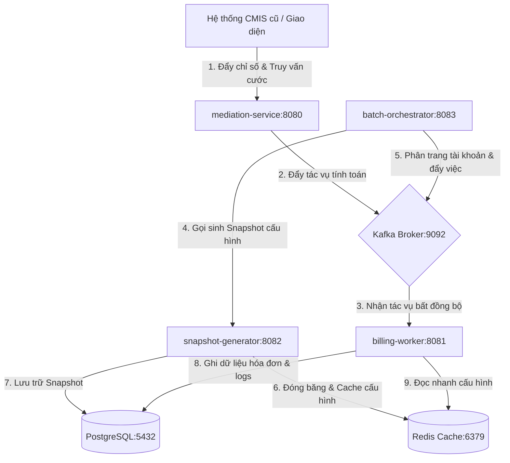
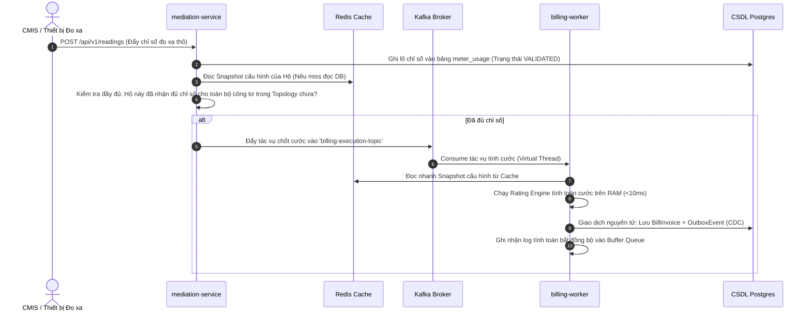
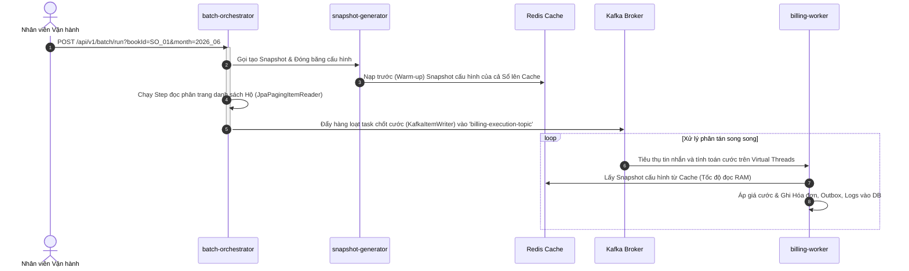
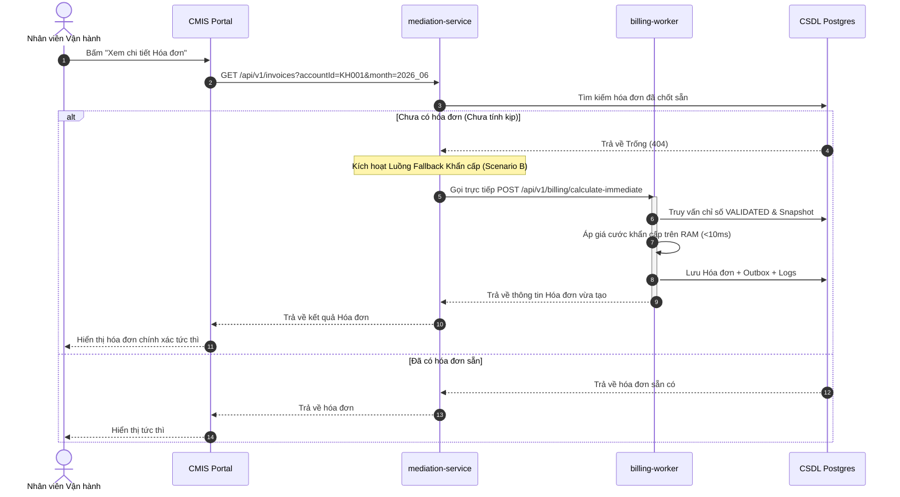

# Phân Tích Chi Tiết Luồng Hoạt Động Hệ Thống (System Workflow Analysis)

Hệ thống tính cước mới được thiết kế theo kiến trúc **Microservices hướng sự kiện (Event-Driven Architecture)**, sử dụng **Java 21 Virtual Threads (Project Loom)**, **Apache Kafka** làm xương sống truyền tin, và **Redis Cache** để tối ưu hóa hiệu năng chốt cước quy mô lớn (hàng triệu hộ dân) đồng thời đảm bảo khả năng tích hợp/fallback đồng bộ cho hệ thống CMIS cũ.

---

## 1. Bản Đồ Phân Phối Trách Nhiệm Các Microservices

Hệ thống bao gồm 4 phân hệ cốt lõi hoạt động phối hợp:

* **`mediation-service` (Cổng 8080)**: Đầu mối tiếp nhận các chỉ số đo xa (từ HES hoặc CMIS), kiểm tra điều kiện đầy đủ chỉ số của điểm đo và quản lý kịch bản Fallback đồng bộ khi CMIS truy vấn hóa đơn chưa tính.
* **`snapshot-generator` (Cổng 8082)**: Đóng băng sơ đồ liên kết công tơ, biểu giá và định mức hộ của khách hàng thành Snapshot tĩnh. Chịu trách nhiệm đồng bộ cấu hình (warm-up) lên Redis Cache.
* **`batch-orchestrator` (Cổng 8083)**: Phân hệ sử dụng **Spring Batch** để chốt sổ định kỳ, thực hiện quét hàng triệu tài khoản theo Sổ, phân trang và đẩy việc vào Kafka để xử lý song song.
* **`billing-worker` (Cổng 8081)**: Trái tim tính toán của hệ thống. Chạy engine áp giá trên RAM, thực hiện ghi hóa đơn, phát sự kiện Outbox (CDC) và ghi nhận nhật ký tính toán bất đồng bộ.

---

## 2. Ba Luồng Nghiệp Vụ Hoạt Động Lõi

Hệ thống vận hành song song 3 luồng tính toán cước tùy theo kịch bản:

### Luồng 1: Tính Cước Cuốn Chiếu Tự Động (Reactive Ingestion Flow)
Đây là luồng chính chạy ngầm 24/7 để giảm tải tối đa cho hệ thống vào ngày chốt số. Hệ thống tính cước cuốn chiếu cho từng khách hàng ngay khi có đủ chỉ số.

### Luồng 2: Chốt Sổ Hàng Loạt Tự Động (Spring Batch Book Billing Flow)
Luồng chốt sổ định kỳ theo yêu cầu của nhân viên vận hành thông qua Spring Batch.

### Luồng 3: Truy Vấn Đồng Bộ & Tính Cước Khẩn Cấp (On-Demand Sync Fallback - Scenario B)
Kịch bản xảy ra khi nhân viên vừa sửa chỉ số tay trên CMIS và bấm xem hóa đơn ngay lập tức, khiến luồng bất đồng bộ chưa kịp xử lý xong.

---

## 3. Các Giải Pháp Kỹ Thuật Đột Phá Đảm Bảo Hiệu Năng

Hệ thống chốt cước đạt thông lượng vượt trội (hơn 10,000 hóa đơn/giây trên hạ tầng phổ thông) nhờ các thiết kế kỹ thuật sau:

### 1. Luồng xử lý Virtual Threads (Project Loom)
Trong phân hệ [KafkaConsumerConfig.java](file:///Volumes/Code%201/Caculator-billing/billing-worker/src/main/java/com/evn/billing/worker/config/KafkaConsumerConfig.java), toàn bộ quá trình tiêu thụ thông điệp từ Kafka và xử lý tính toán được phân phối cho các Virtual Threads. 
* Thay vì bị giới hạn bởi số lượng Thread vật lý của CPU (Platform Threads) gây nghẽn cổ chai khi chờ I/O của database, Virtual Threads cho phép hệ thống tạo ra hàng chục nghìn luồng tính toán nhẹ, tối ưu hóa 100% tài nguyên phần cứng.

### 2. Mô hình Cache-aside (Snapshot Warm-up)
* Việc tính cước cho các khách hàng phức tạp đòi hỏi phải truy vấn cơ sở dữ liệu nhiều lần để xây dựng cây phân cấp công tơ (Topology) và nạp biểu giá.
* Trong [SnapshotGeneratorService.java](file:///Volumes/Code%201/Caculator-billing/snapshot-generator/src/main/java/com/evn/billing/snapshot/service/SnapshotGeneratorService.java), trước khi chạy tính cước, toàn bộ cấu hình này được đóng băng tĩnh thành một đối tượng JSON duy nhất và nạp sẵn lên **Redis Cache** với thời gian sống (TTL) 24 giờ. Khi Worker chạy, nó chỉ cần đọc cấu hình từ Redis trên RAM với độ trễ cực thấp (<1ms) thay vì truy vấn JOIN nhiều bảng trong PostgreSQL.

### 3. Ghi Log Tính Toán Bất Đồng Bộ (Async Buffer Logging)
* Việc ghi chi tiết giải trình áp giá cho từng khách hàng (đặc biệt là hộ có sản lượng lớn hoặc nhiều biểu giá) vào CSDL nếu chạy đồng bộ sẽ làm giảm 80% thông lượng của luồng tính toán hóa đơn chính.
* Giải pháp trong [BillingLogService.java](file:///Volumes/Code%201/Caculator-billing/billing-worker/src/main/java/com/evn/billing/worker/service/BillingLogService.java):
  * Khi tính toán hoàn tất, Worker đẩy thông tin log vào một hàng đợi không khóa `ConcurrentLinkedQueue` trên RAM (`enqueueLog()`).
  * Một bộ lập lịch chạy ngầm (`@Scheduled(fixedDelay = 200)`) sẽ định kỳ mỗi 200 miligiây quét hàng đợi, gom nhóm thành các lô tối đa 1,000 bản ghi, và thực hiện chèn số lượng lớn (`batchUpdate`) vào Postgres thông qua một kết nối duy nhất.
  * Cơ chế này cô lập hoàn toàn hiệu năng của luồng tính cước chính khỏi tốc độ đĩa của cơ sở dữ liệu.

### 4. Giao Dịch Outbox (Transactional Outbox Pattern)
* Để đồng bộ hóa đơn sang hệ thống kế toán hoặc gửi email cho khách hàng mà không làm chậm luồng tính cước, Worker ghi nhận sự kiện `INVOICE_CREATED` vào bảng `outbox_event` dưới cùng một DB Transaction của hóa đơn.
* Phân hệ CDC (như Debezium) sẽ đọc log ghi trước (WAL) của PostgreSQL và phát tán sự kiện sang các hàng đợi thông báo downstream một cách bất đồng bộ và an toàn, đảm bảo tính nhất quán cuối cùng (Eventual Consistency).
