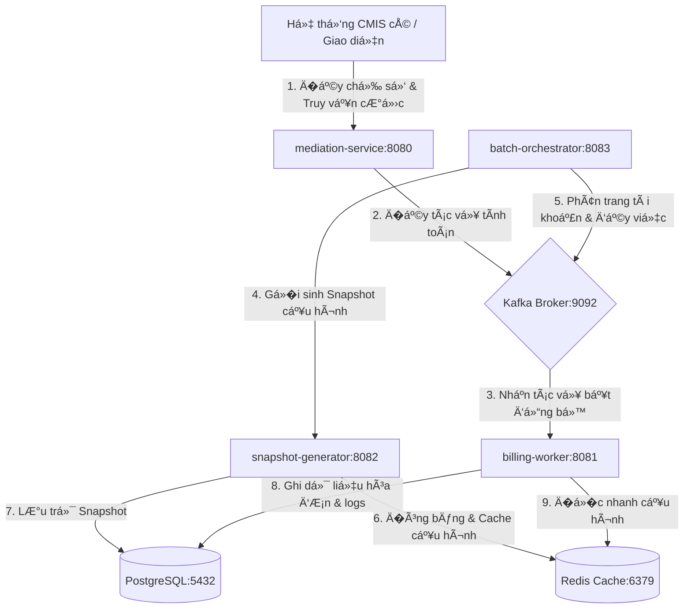
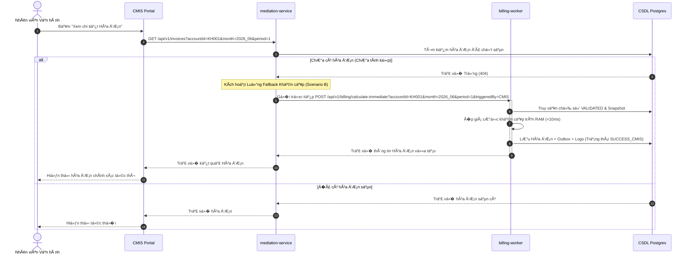

# Phân Tích Chi Tiết Luồng Hoạt �ộng Hệ Thống (System Workflow Analysis)

Hệ thống tính cước mới được thiết kế theo kiến trúc **Microservices hướng sự kiện (Event-Driven Architecture)**, sử dụng **Java 21 Virtual Threads (Project Loom)**, **Apache Kafka** làm xương sống truy�n tin, và **Redis Cache** để tối ưu hóa hiệu năng chốt cước quy mô lớn (hàng triệu hộ dân) đồng th�i đảm bảo khả năng tích hợp/fallback đồng bộ cho hệ thống CMIS cũ.

---

## 1. Bản �ồ Phân Phối Trách Nhiệm Các Microservices

Hệ thống bao gồm 4 phân hệ cốt lõi hoạt động phối hợp:


```mermaid
graph TD
    CMIS[Hệ thống CMIS cũ / Giao diện] -- 1. �ẩy chỉ số & Truy vấn cước --> Med[mediation-service:8080]
    Med -- 2. �ẩy tác vụ tính toán --> Kafka{Kafka Broker:9092}
    Kafka -- 3. Nhận tác vụ bất đồng bộ --> Worker[billing-worker:8081]
    
    Orch[batch-orchestrator:8083] -- 4. G�i sinh Snapshot cấu hình --> Snap[snapshot-generator:8082]
    Orch -- 5. Phân trang tài khoản & đẩy việc --> Kafka
    
    Snap -- 6. �óng băng & Cache cấu hình --> Redis[(Redis Cache:6379)]
    Snap -- 7. Lưu trữ Snapshot --> Postgres[(PostgreSQL:5432)]
    
    Worker -- 8. Ghi dữ liệu hóa đơn & logs --> Postgres
    Worker -- 9. ��c nhanh cấu hình --> Redis
```

* **`mediation-service` (Cổng 8080)**: �ầu mối tiếp nhận các chỉ số đo xa (từ HES hoặc CMIS), kiểm tra đi�u kiện đầy đủ chỉ số của điểm đo và quản lý kịch bản Fallback đồng bộ khi CMIS truy vấn hóa đơn chưa tính.
* **`snapshot-generator` (Cổng 8082)**: �óng băng sơ đồ liên kết công tơ, biểu giá và định mức hộ của khách hàng thành Snapshot tĩnh. Chịu trách nhiệm đồng bộ cấu hình (warm-up) lên Redis Cache.
* **`batch-orchestrator` (Cổng 8083)**: Phân hệ sử dụng **Spring Batch** để chốt sổ định kỳ, thực hiện quét hàng triệu tài khoản theo Sổ, phân trang và đẩy việc vào Kafka để xử lý song song.
* **`billing-worker` (Cổng 8081)**: Trái tim tính toán của hệ thống. Chạy engine áp giá trên RAM, thực hiện ghi hóa đơn, phát sự kiện Outbox (CDC) và ghi nhận nhật ký tính toán bất đồng bộ.

---

## 2. Ba Luồng Nghiệp Vụ Hoạt �ộng Lõi

Hệ thống vận hành song song 3 luồng tính toán cước tùy theo kịch bản:

### Luồng 1: Tính Cước Cuốn Chiếu Tự �ộng (Reactive Ingestion Flow)
�ây là luồng chính chạy ngầm 24/7 để giảm tải tối đa cho hệ thống vào ngày chốt số. Hệ thống tính cước cuốn chiếu cho từng khách hàng ngay khi có đủ chỉ số.

```mermaid
sequenceDiagram
    autonumber
    actor CMIS as CMIS / Thiết bị �o xa
    participant Med as mediation-service
    participant Redis as Redis Cache
    participant Kafka as Kafka Broker
    participant Worker as billing-worker
    participant DB as CSDL Postgres

    CMIS->>Med: POST /api/v1/readings (�ẩy chỉ số đo xa thô)
    Med->>DB: Ghi lô chỉ số vào bảng meter_usage (Trạng thái VALIDATED)
    Med->>Redis: ��c Snapshot cấu hình của Hộ (Nếu miss đ�c DB)
    Med->>Med: Kiểm### Luồng 2: Chốt Sổ Hàng Loạt Tự �ộng (Spring Batch Book Billing Flow)
Luồng chốt sổ định kỳ theo yêu cầu của nhân viên vận hành thông qua Spring Batch. Hệ thống hỗ trợ chạy phân đợt (`period`) và có cơ chế tối ưu hóa chốt cước lũy tiến/tái tục (Resumable Batch).

```mermaid
sequenceDiagram
    autonumber
    actor User as Nhân viên Vận hành
    participant Batch as batch-orchestrator
    participant Snap as snapshot-generator
    participant Redis as Redis Cache
    participant Kafka as Kafka Broker
    participant Worker as billing-worker

    User->>Batch: POST /api/v1/batch/run?bookId=SO_01&month=2026_06&period=1&version=1
    activate Batch
    Batch->>Snap: G�i tạo Snapshot & �óng băng cấu hình
    Snap->>Redis: Nạp trước (Warm-up) Snapshot cấu hình của cả Sổ lên Cache
    Note over Batch: Hook beforeJob: Chuyển đổi trạng thái SUCCESS -> SUCCESS_CMIS<br/>Khởi tạo tiến độ trên book_billing_schedule
    Batch->>Batch: Chạy Step đ�c phân trang danh sách Hộ (JpaPagingItemReader)<br/>L�c b� các hộ đã có trạng thái SUCCESS hoặc SUCCESS_CMIS
    Batch->>Kafka: �ẩy hàng loạt task chốt cước (KafkaItemWriter) vào 'billing-execution-topic'
    deactivate Batch
    
    loop Xử lý phân tán song song
        Kafka->>Worker: Tiêu thụ tin nhắn và tính toán cước trên Virtual Threads
        Worker->>Redis: Lấy Snapshot cấu hình từ Cache (Tốc độ đ�c RAM)
        Worker->>Worker: �p giá cước & Ghi Hóa đơn, Outbox, Logs vào DB với trạng thái SUCCESS_CMIS
        Worker->>Batch: Cập nhật tiến độ processed_accounts, success_accounts vào book_billing_schedule
    end
```

#### Cơ chế Tái Tục và Idempotent Chốt Sổ (Incremental & Resumable Batch)
1. **L�c tài khoản thông minh**: `JpaPagingItemReader` trong [BillingBatchConfig.java](file:///e:/caculator-billing-evncit/batch-orchestrator/src/main/java/com/evn/billing/batch/config/BillingBatchConfig.java) truy vấn danh sách tài khoản theo câu lệnh:
   ```sql
   SELECT a FROM Account a WHERE a.bookId = :bookId AND a.status = 'ACTIVE'
   AND NOT EXISTS (SELECT abs FROM AccountBillingStatus abs
   WHERE abs.accountId = a.accountId AND abs.billingCycleMonth = :month
   AND abs.period = :period AND abs.status IN ('SUCCESS', 'SUCCESS_CMIS'))
   ```
   Nh� đó, khi một Job bị gián đoạn và chạy lại (hoặc chạy đè), Spring Batch chỉ chốt cước cho những tài khoản chưa chốt thành công trong đợt đó.
2. **Khóa chốt cước CMIS (`SUCCESS_CMIS`)**:
   - Khi chạy cuốn chiếu ngầm, các tài khoản được tính cước thành công sẽ có trạng thái `SUCCESS`.
   - Khi Job chốt sổ (Batch) hoặc yêu cầu On-Demand từ CMIS kích hoạt, trạng thái lưu xuống database của tài khoản là `SUCCESS_CMIS`.
   - Trước khi Job bắt đầu chạy, listener `beforeJob` trong [BillingJobListener.java](file:///e:/caculator-billing-evncit/batch-orchestrator/src/main/java/com/evn/billing/batch/listener/BillingJobListener.java) sẽ tự động chuyển đổi toàn bộ tài khoản của Sổ đó từ `SUCCESS` thành `SUCCESS_CMIS` và nạp vào tiến độ ban đầu của Sổ nhằm ngăn ngừa việc tính toán lại vô ích.
3. **Quản lý tiến trình qua Bảng Hợp Nhất**: Toàn bộ tiến trình chạy Job được giám sát và cập nhật thông qua bảng `book_billing_schedule` (thay thế cho bảng cũ `book_billing_run`) giúp quản lý tập trung cả thông tin lịch trình (`status`) lẫn trạng thái thực thi hiện th�i (`run_status` bao gồm `PENDING`, `PROCESSING`, `COMPLETED`, `FAILED`).

---

### Luồng 3: Truy Vấn �ồng Bộ & Tính Cước Khẩn Cấp (On-Demand Sync Fallback - Scenario B)
Kịch bản xảy ra khi nhân viên vừa sửa chỉ số tay trên CMIS và bấm xem hóa đơn ngay lập tức, khiến luồng bất đồng bộ chưa kịp xử lý xong.


```mermaid
sequenceDiagram
    autonumber
    actor User as Nhân viên Vận hành
    participant CMIS as CMIS Portal
    participant Med as mediation-service
    participant Worker as billing-worker
    participant DB as CSDL Postgres
 
    User->>CMIS: Bấm "Xem chi tiết Hóa đơn"
    CMIS->>Med: GET /api/v1/invoices?accountId=KH001&month=2026_06&period=1
    Med->>DB: Tìm kiếm hóa đơn đã chốt sẵn
    alt Chưa có hóa đơn (Chưa tính kịp)
        DB-->>Med: Trả v� Trống (404)
        Note over Med: Kích hoạt Luồng Fallback Khẩn cấp (Scenario B)
        Med->>Worker: G�i trực tiếp POST /api/v1/billing/calculate-immediate?accountId=KH001&month=2026_06&period=1&triggeredBy=CMIS
        activate Worker
        Worker->>DB: Truy vấn chỉ số VALIDATED & Snapshot
        Worker->>Worker: �p giá cước khẩn cấp trên RAM (<10ms)
        Worker->>DB: Lưu Hóa đơn + Outbox + Logs (Trạng thái SUCCESS_CMIS)
        Worker-->>Med: Trả v� thông tin Hóa đơn vừa tạo
        deactivate Worker
        Med-->>CMIS: Trả v� kết quả Hóa đơn
        CMIS-->>User: Hiển thị hóa đơn chính xác tức thì
    else �ã có hóa đơn sẵn
        DB-->>Med: Trả v� hóa đơn sẵn có
        Med-->>CMIS: Trả v� hóa đơn
        CMIS-->>User: Hiển thị tức th�i
    end
```

---

### Luồng 4: Quy Tắc Hủy Cước �ệ Quy & Khóa Trạng Thái (Cascading Cancellation & Gated Pipeline Lock Rule)
Nhằm duy trì tính nhất quán dữ liệu lưới điện netting (công tơ tổng - phụ) và quy trình kế toán, hệ thống bổ sung hai quy tắc bảo mật dữ liệu lõi trong [BillingService.java](file:///e:/caculator-billing-evncit/billing-worker/src/main/java/com/evn/billing/worker/service/BillingService.java):

1. **Khóa chống hủy cước (Gated Pipeline Lock Rule)**:
   - Hệ thống nghiêm cấm hủy cước đối với các tài khoản mà hóa đơn đã được khóa (`LOCKED`) hoặc đã phát hành hóa đơn điện tử (`E_INVOICE_ISSUED`).
   - Nếu thực hiện g�i lệnh hủy cước cho một tài khoản có trạng thái trên, hệ thống sẽ ném ra ngoại lệ `IllegalStateException` và hủy b� giao dịch.
2. **Hủy cước đệ quy (Cascading Cancellation)**:
   - Khi một hộ phụ tải (công tơ con) bị hủy cước, sản lượng netting của hộ cha (công tơ tổng) sẽ không còn chính xác.
   - Do đó, hệ thống sẽ tự động tìm kiếm tất cả các hộ cha liên quan trong cây Topology (qua bảng `meter_relation`) và đệ quy kích hoạt hủy cước đối với các hộ cha này để đảm bảo kỳ tính cước tiếp theo sẽ buộc phải tính toán lại từ đầu một cách đồng bộ.

---

### Luồng 5: Các API �i�u Khiển & �ồng Bộ Trạng Thái
Hệ thống cung cấp thêm bộ API nghiệp vụ phục vụ việc đồng bộ và quản lý tiến trình giữa CMIS và Billing Engine:
1. **Khóa cước (`POST /api/v1/billing/lock`)**: Cập nhật trạng thái chốt cước của tài khoản khách hàng thành `LOCKED` hoặc `E_INVOICE_ISSUED` sau khi CMIS phát hành hóa đơn thành công. API này thực hiện cập nhật đồng th�i xuống Database PostgreSQL, Redis Hash Cache (`billing:book_status_hash:{bookId}:{month}:{period}`) và bộ nhớ đệm JVM.
2. **Kiểm tra tiến độ chốt cước Sổ (`GET /api/v1/billing/book-progress`)**: Trả v� tổng quan số lượng tài khoản trong Sổ, số hộ đã xử lý thành công, thất bại và tổng số điểm đo đã hợp lệ chỉ số (`readingsValidated`) hoặc đang thiếu chỉ số (`readingsPending`).
3. **Danh sách tài khoản theo trạng thái (`GET /api/v1/billing/accounts-by-status`)**: Hỗ trợ CMIS phân trang lấy danh sách các hộ thuộc một Sổ có các trạng thái nhất định (ví dụ: tìm các hộ bị `FAILED` để kiểm tra lỗi hoặc hộ đã `LOCKED` để xuất dữ liệu).

---

## 3. Các Giải Pháp Kỹ Thuật �ột Phá �ảm Bảo Hiệu Năng

Hệ thống chốt cước đạt thông lượng vượt trội (hơn 10,000 hóa đơn/giây trên hạ tầng phổ thông) nh� các thiết kế kỹ thuật sau:

### 1. Luồng xử lý Virtual Threads (Project Loom)
Trong phân hệ [KafkaConsumerConfig.java](file:///e:/caculator-billing-evncit/billing-worker/src/main/java/com/evn/billing/worker/config/KafkaConsumerConfig.java), toàn bộ quá trình tiêu thụ thông điệp từ Kafka và xử lý tính toán được phân phối cho các Virtual Threads. 
* Thay vì bị giới hạn bởi số lượng Thread vật lý của CPU (Platform Threads) gây nghẽn cổ chai khi ch� I/O của database, Virtual Threads cho phép hệ thống tạo ra hàng chục nghìn luồng tính toán nhẹ, tối ưu hóa 100% tài nguyên phần cứng.

### 2. Mô hình Cache-aside (Snapshot Warm-up)
* Việc tính cước cho các khách hàng phức tạp đòi h�i phải truy vấn cơ sở dữ liệu nhi�u lần để xây dựng cây phân cấp công tơ (Topology) và nạp biểu giá.
* Trong [SnapshotGeneratorService.java](file:///e:/caculator-billing-evncit/snapshot-generator/src/main/java/com/evn/billing/snapshot/service/SnapshotGeneratorService.java), trước khi chạy tính cước, toàn bộ cấu hình này được đóng băng tĩnh thành một đối tượng JSON duy nhất và nạp sẵn lên **Redis Cache** với th�i gian sống (TTL) 24 gi�. Khi Worker chạy, nó chỉ cần đ�c cấu hình từ Redis trên RAM với độ trễ cực thấp (<1ms) thay vì truy vấn JOIN nhi�u bảng trong PostgreSQL.

### 3. Ghi Log Tính Toán Bất �ồng Bộ (Async Buffer Logging)
* Việc ghi chi tiết giải trình áp giá cho từng khách hàng (đặc biệt là hộ có sản lượng lớn hoặc nhi�u biểu giá) vào CSDL nếu chạy đồng bộ sẽ làm giảm 80% thông lượng của luồng tính toán hóa đơn chính.
* Giải pháp trong [BillingLogService.java](file:///e:/caculator-billing-evncit/billing-worker/src/main/java/com/evn/billing/worker/service/BillingLogService.java):
  * Khi tính toán hoàn tất, Worker đẩy thông tin log vào một hàng đợi không khóa `ConcurrentLinkedQueue` trên RAM (`enqueueLog()`).
  * Một bộ lập lịch chạy ngầm (`@Scheduled(fixedDelay = 200)`) sẽ định kỳ mỗi 200 miligiây quét hàng đợi, gom nhóm thành các lô tối đa 1,000 bản ghi, và thực hiện chèn số lượng lớn (`batchUpdate`) vào Postgres thông qua một kết nối duy nhất.
  * Cơ chế này cô lập hoàn toàn hiệu năng của luồng tính cước chính kh�i tốc độ đĩa của cơ sở dữ liệu.

### 4. Giao Dịch Outbox (Transactional Outbox Pattern)
* �ể đồng bộ hóa đơn sang hệ thống kế toán hoặc gửi email cho khách hàng mà không làm chậm luồng tính cước, Worker ghi nhận sự kiện `INVOICE_CREATED` vào bảng `outbox_event` dưới cùng một DB Transaction của hóa đơn.
* Phân hệ CDC (nhÆ° Debezium) sẽ Ä‘á»�c log ghi trÆ°á»›c (WAL) của PostgreSQL và phát tán sá»± kiện sang các hàng đợi thông báo downstream má»™t cách bất đồng bá»™ và an toàn, đảm bảo tính nhất quán cuối cùng (Eventual Consistency).º·c biệt là há»™ có sản lượng lá»›n hoặc nhiá»�u biểu giá) vào CSDL nếu chạy đồng bá»™ sẽ làm giảm 80% thông lượng của luồng tính toán hóa Ä‘Æ¡n chính.
* Giải pháp trong [BillingLogService.java](file:///Volumes/Code%201/Caculator-billing/billing-worker/src/main/java/com/evn/billing/worker/service/BillingLogService.java):
  * Khi tính toán hoàn tất, Worker đẩy thông tin log vào một hàng đợi không khóa `ConcurrentLinkedQueue` trên RAM (`enqueueLog()`).
  * Một bộ lập lịch chạy ngầm (`@Scheduled(fixedDelay = 200)`) sẽ định kỳ mỗi 200 miligiây quét hàng đợi, gom nhóm thành các lô tối đa 1,000 bản ghi, và thực hiện chèn số lượng lớn (`batchUpdate`) vào Postgres thông qua một kết nối duy nhất.
  * Cơ chế này cô lập hoàn toàn hiệu năng của luồng tính cước chính kh�i tốc độ đĩa của cơ sở dữ liệu.

### 4. Giao Dịch Outbox (Transactional Outbox Pattern)
* �ể đồng bộ hóa đơn sang hệ thống kế toán hoặc gửi email cho khách hàng mà không làm chậm luồng tính cước, Worker ghi nhận sự kiện `INVOICE_CREATED` vào bảng `outbox_event` dưới cùng một DB Transaction của hóa đơn.
* Phân hệ CDC (như Debezium) sẽ đ�c log ghi trước (WAL) của PostgreSQL và phát tán sự kiện sang các hàng đợi thông báo downstream một cách bất đồng bộ và an toàn, đảm bảo tính nhất quán cuối cùng (Eventual Consistency).
