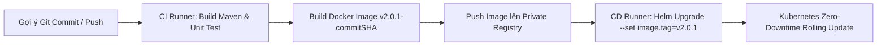

# ⛵ Hướng Dẫn Sử Dụng Helm Chart & Quy Trình CI/CD Cho EVN Billing

Tài liệu này giải thích chi tiết **Cách sử dụng Helm Chart** để quản lý ứng dụng trên Kubernetes và **Quy trình CI/CD** (Local Development vs Production Release) mỗi khi bạn chỉnh sửa mã nguồn.

---

## 🎯 PHẦN 1: Tại Sao Nên Dùng Helm Chart?

Thay vì phải chạy 5 câu lệnh `kubectl apply -f k8s/` thủ công mỗi lần thay đổi cấu hình, **Helm** đóng vai trò như bộ quản lý gói (Package Manager tương tự `npm` hay `pip`) cho Kubernetes.

### Các lệnh Helm cơ bản cần nhớ:

1. **Cài đặt / Nâng cấp toàn bộ hệ thống bằng 1 câu lệnh duy nhất:**
   ```bash
   helm upgrade --install evn-billing ./helm/evn-billing-chart -n evn-billing --create-namespace
   ```

2. **Xem danh sách các ứng dụng (Releases) đang chạy:**
   ```bash
   helm list -n evn-billing
   ```

3. **Thay đổi cấu hình linh hoạt (Override values):**
   *Ví dụ: Tăng số lượng Worker Pods lên 8 pods:*
   ```bash
   helm upgrade evn-billing ./helm/evn-billing-chart -n evn-billing --set worker.replicaCount=8
   ```

4. **Rollback (Quay lại phiên bản trước đó nếu bị lỗi code):**
   ```bash
   helm rollback evn-billing 1 -n evn-billing
   ```

---

## 🔄 PHẦN 2: Quy Trình CI/CD Khi Chỉnh Sửa Mã Nguồn (Code Iteration)

### A. Vòng Lặp Phát Triển Local (Local Inner Loop - Fast Dev)

Mỗi khi bạn sửa code Java (ví dụ tinh chỉnh công thức tính cước trong `billing-worker`):

#### Cách 1: Chạy Tập Lệnh 1-Click (`deploy-local.ps1`)
Mở PowerShell tại thư mục dự án và chạy:
```powershell
.\deploy-local.ps1
```
> **Tự động hoàn toàn:** Tập lệnh sẽ tự biên dịch Maven $\rightarrow$ build Docker Image $\rightarrow$ tự thực hiện `helm upgrade` để cập nhật Pods trên K8s!

#### Cách 2: Thao Tác Thủ Công
```bash
# 1. Build lại JAR
mvn clean package -DskipTests -pl billing-worker -am

# 2. Build lại Docker Image local
docker build -t billing-worker:latest ./billing-worker

# 3. Ép K8s khởi động lại Pods với Image mới
kubectl rollout restart deployment/evn-billing-worker -n evn-billing
```

---

### B. Quy Trình CI/CD Sản Xuất (Production CI/CD Pipeline)

Trên môi trường thật (Sử dụng GitHub Actions / GitLab CI):



1. **Mỗi khi Push code lên nhánh `main`:**
   * CI Pipeline tự động chạy `mvn test`.
   * Tạo Docker Image đính kèm mã Hash Git: `registry.evn.com.vn/billing/billing-worker:v2.0.1-a8f93c`.
2. **Kích hoạt Deploy:**
   * Chạy lệnh `helm upgrade` truyền tham số image tag mới:
     ```bash
     helm upgrade evn-billing ./helm/evn-billing-chart \
       --set worker.image.tag=v2.0.1-a8f93c \
       --set global.imagePullPolicy=Always
     ```
   * Kubernetes thực hiện **Rolling Update** (Thay thế Pod cũ bằng Pod mới dần dần, đảm bảo **0% Downtime** không gián đoạn tính cước).
